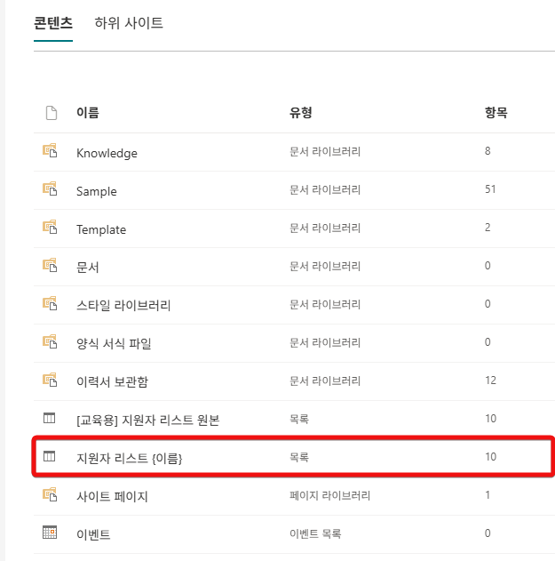

# 스크린샷 보완·본문 교정 작업 지침

이 저장소를 클론해서 **스크린샷을 다시 찍고 본문을 고치는** 사람을 위한 문서다.
무엇을 고쳐야 하는지는 [실측_리포트_2026-09.md](실측_리포트_2026-09.md) 에 있다. 이 문서는 **어떻게** 고치는지를 다룬다.

---

## 1. 먼저 돌려 본다

```bash
bundle install
bundle exec jekyll serve
```

`http://127.0.0.1:4000` 에서 사이트가 뜬다. 고치는 동안 켜 두면 저장할 때마다 다시 빌드된다.

검증은 둘이다. **커밋 전에 둘 다 돌린다.**

```bash
bundle exec jekyll build
python _instructions/linkcheck.py
python _instructions/stylecheck.py
```

- `linkcheck.py` — 끊어진 링크·이미지, 그리고 **단계 번호가 화면에서 이어지는지**를 본다. `ADVANCED`·`OTHER`·`step numbering` 이 **셋 다 0** 이어야 통과다(0 이 아니면 exit 1).
- `stylecheck.py` — 문체 점수. 현재 **62점(C)** 이고 감점의 99% 가 **볼드 과다**다. 점수를 떨어뜨리지만 않으면 된다.

> `README.md` 에 `python ../_tools/sync_infra.py` 가 적혀 있는데, **이 저장소만 클론했다면 그 스크립트가 없다.** 교안 저장소 셋(`cs_lab`·`cs_lab_adv`·`cs_lab_ghcp`)이 인프라 파일 7개를 공유하고 그걸 대조하는 도구다. 여기서는 건너뛴다.

---

## 2. 단계 번호 — 여기서 제일 많이 깨진다

랩 본문은 `1.` `2.` `3.` … 으로 이어지는 하나의 긴 목록인데, `###` 소제목이 중간에 들어가면 **kramdown 이 목록을 끊고 다음 목록을 다시 1번부터 매긴다.**

그래서 **`###` 섹션마다 첫 단계 바로 위에** 시작 번호를 명시한다.

```markdown
### 토픽 만들기

{: start="13" }
13. **토픽** 메뉴에서 …
```

두 가지가 **함께** 있어야 화면에 반영된다.

1. 마크다운의 `{: start="N" }` IAL — **`---` 바로 뒤에 오거나 앞에 빈 줄이 있으면 조용히 무효가 된다**(실제로 두 번 재발했다)
2. `_sass/custom/custom.scss` 의 「순서 목록 — start 속성 존중」 블록 — 테마가 CSS 카운터로 번호를 직접 그려서 `start` 를 무시하므로 그걸 꺼야 한다

**단계를 추가하거나 지우면 뒤따르는 모든 섹션의 `N` 도 같이 옮겨야 한다.** 이게 수작업이라 잘 틀린다 — `linkcheck.py` 가 잡아 주니 반드시 돌린다.

**VS Code 미리보기는 판정 기준이 아니다.** 미리보기는 `{: start="N" }` 을 글자 그대로 보여 준다. 실제 번호는 `jekyll build` 후 브라우저에서 본다.

---

## 3. 스크린샷

### 파일 배치

```
assets/lab1/ … assets/lab7/   랩별 컷
assets/lab4-alt/               Lab 4 대안 전용 컷
assets/appendix/               부록 컷
```

이름은 **단계 번호 두 자리**다 — `08.png`, `12.png`. 한 단계에 여러 장이면 뒤에 알파벳을 붙인다 — `12b.png`, `14c.png`.

본문에서는 문서 기준 상대경로로 참조한다.

```markdown

```

> **`/capture` 스킬이 이 절을 자동으로 진행한다.** 남은 컷을 세고, 한 장씩 「어느 화면 · 어떤 상태 ·
> 담을 것 · 저장 경로」를 일러 주고, 찍은 파일을 열어 검사한 뒤 「촬영:」 표시를 지운다.
> 아래는 그 스킬이 무엇을 하는지에 대한 설명이다.

### 「촬영:」 접두사 = 아직 안 찍은 컷

alt 텍스트가 `촬영:` 으로 시작하면 **그 자리는 아직 제대로 된 컷이 아니다**(다른 랩 것을 임시로 재사용하고 있거나 화면이 낡았다).

```markdown

```

현재 남은 촬영 대기분:

| 문서 | 이미지 | 촬영 대기 |
|---|---|---|
| lab4.md | 44 | **14** |
| lab4-alt.md | 35 | **6** — 전부 `assets/lab4/` 를 가리킨다 |
| lab7.md | 63 | **4** |
| 나머지 | — | 0 |

**실제로 찍을 파일은 18장이다.** `lab4.md` 와 `lab4-alt.md` 가 `assets/lab4/` 를 함께 쓰고 있어
lab4-alt 의 6장은 lab4 의 14장에 포함된다 — 한 장을 찍으면 양쪽이 같이 해결되고,
**「촬영:」 표시는 두 문서에서 다 지워야 한다.**

```bash
grep -rn '!\[촬영:' docs/          # 남은 것 전부 보기
```

**다시 찍었으면 alt 텍스트에서 `촬영: ` 를 지운다.** 그게 완료 표시다.

### 찍을 때

- 화면은 **한국어 UI** 기준이다.
- 계정 표시 이름이 화면 곳곳에 찍힌다. 지금 `edu@2ktech.co.kr` 의 표시명이 **「교육」**인데 「에듀」로 바꿀지 아직 안 정했다 — **찍기 전에 확정한다.** 나중에 바꾸면 전부 다시 찍어야 한다.
- 고객사명·개인정보가 화면에 들어가지 않게 한다. 이 저장소는 공개다.
- 캡션(alt 텍스트)은 **무엇을 보라는 것인지**를 적는다. 「①·②·③」처럼 순서를 가리키는 캡션은 화면의 실제 순서와 맞는지 확인한다.

### 고아 이미지

Lab 7 을 58단계로 줄이면서 참조가 끊긴 컷이 11장 있다 — `assets/lab7/` 의 `34 35 36 36b 41 42b 45 45b 46 47 32b`.
재촬영 대상을 정할 때 **지울지 되살릴지 함께 정한다.**

```bash
# 참조되지 않는 이미지 찾기
for f in assets/lab7/*.png; do grep -q "$(basename $f)" docs/lab7.md || echo "orphan: $f"; done
```

---

## 4. 본문 고칠 때

### 저작 메모는 학생에게 안 보인다

각 랩 머리에 `<!-- 저작 메모(학생 비노출): … -->` 블록이 있다. **결정과 그 이유**가 거기 쌓인다.
**본문을 고치면 그 아래에 날짜와 함께 무엇을 왜 고쳤는지 한 줄 남긴다.** 다음 사람이 되돌리지 않게 하는 장치다.

### 문체

`C:\Users\<you>\.claude\CLAUDE.md` 같은 개인 설정이 아니라, 이 교안 자체의 규칙이다.

- 서술은 평서형(`~합니다`). 한 문서 안에서 섞지 않는다
- **한 문단에 볼드는 하나까지.** 지금 `stylecheck.py` 감점의 99% 가 이것이다
- 독자의 심리를 넘겨짚지 않는다 — 「여기서 당황하지 마세요」 대신 「준비됨으로 바뀌기 전에는 답하지 않습니다」
- 진행 상황을 중계하지 않는다 — 「거의 다 왔습니다」 같은 것
- 이미 적은 사실을 위협조로 되풀이하지 않는다 — 앞 문장이 이유를 말했으면 뒤 문장은 지운다
- 콜아웃 등급을 남발하지 않는다. 최상위 등급이 다섯 개면 등급이 없는 것과 같다

### 콜아웃

`_config.yml` 에 정의돼 있다. 본문에서는 이렇게 쓴다.

```markdown
{: .important }
**이 랩은 두 개를 만듭니다.** 먼저 흐름을 만들고, 그 다음 토픽을 만듭니다.
```

### 랩 4 와 랩 4-대안은 짝이다

`docs/lab4.md`(322행)와 `docs/lab4-alt.md`(298행)가 **본문 블록 20개를 공유한다.** 차이는 220행뿐이다.
**한쪽만 고치면 반드시 어긋난다.** 둘 중 하나를 건드리면 다른 쪽도 연다.

덧붙여 — **정본이 뒤집힐 예정이다.** 차기 고객사가 Outlook 을 쓰지 않아 lab4-alt 가 본문이 된다. 상세는 실측 리포트의 §정본 교체.

---

## 5. 이 저장소의 구조

```
index.md                  홈 (nav_order: 0) — 시간표·랩 목록
docs/
  before-you-start.md     오리엔테이션
  lab1.md … lab7.md       랩 본문
  lab4-alt.md             Lab 4 대안 (Outlook 미사용)
  appendix/               부록
  glossary.md             용어집 — 본문에서 `#term-flow` 식으로 앵커 참조
assets/                   스크린샷·다운로드물
_instructions/            이 문서와 검증 스크립트 (Jekyll 이 빌드하지 않는다)
```

`nav_order` 가 왼쪽 메뉴 순서다. 부록을 추가하면 뒤따르는 것들을 밀어야 한다.

용어 링크는 `[흐름](./glossary.html#term-flow)` 처럼 쓴다. **새 용어를 본문에 쓰면 용어집에도 항목을 추가한다** — `linkcheck.py` 가 깨진 앵커까지는 못 잡는다.

---

## 6. 실습 환경

| | |
|---|---|
| SharePoint | `https://2ktech.sharepoint.com/sites/edulab` (표시명 **에듀랩**) |
| 목록 | `[교육용] 지원자 리스트 원본` (GUID `a21fdbf7-8c8c-426c-94e0-56d7503aa104`) |
| 이력서 | `edulab/DocLib/이력서샘플/` — **공백 없음** |
| 지식 | `edulab/Knowledge/adv/` |
| Power Automate 환경 | `교육` · 솔루션 `HR 채용 자동화` |
| 에이전트 | `면접관 에이전트` |

다른 테넌트에서 진행하려면 사이트 URL 과 표시명 두 문자열을 본문 전체에서 치환한다.

```bash
grep -rn "2ktech.sharepoint.com/sites/edulab\|에듀랩" docs/ index.md README.md
```

---

## 7. 브랜치와 커밋

**`main` 에 바로 밀지 않는다.** 랩 하나를 브랜치 하나로 잡고, 끝나면 PR 을 연다.
제작자가 별도로 본문 교정을 진행하고 있어 겹칠 수 있다.

```bash
git switch -c shoot/lab7
# … 촬영·교정 …
git push -u origin shoot/lab7
gh pr create --fill
```

브랜치 이름은 `shoot/labN`(촬영) · `fix/labN`(본문 교정)으로 나눈다.
PR 본문에 **찍은 컷 목록과 아직 못 찍은 것**을 적는다 — 리뷰가 그걸 기준으로 돈다.

한 랩씩 끊어서 커밋한다. 메시지는 한국어 평서형으로, **무엇을 왜** 고쳤는지 적는다.

```
docs(lab5): 10단계 콜아웃을 실제 화면에 맞게 뒤집는다

제목 칸이 필수로 나타나므로 「지정하지 않습니다」가 거짓이었다.
트리거 제목 칩을 넣는 조작을 추가.
```

커밋 전에 `jekyll build` → `linkcheck.py` → `stylecheck.py`.
