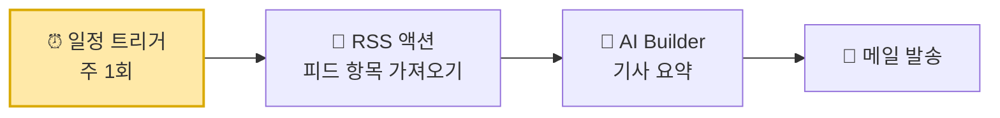

# 부록. 시연 — 외부 자료 뉴스레터 📰

{: .important }
**이 부록은 실습이 아니라 시연입니다.** 따라 만들지 않아도 됩니다. **강의 도입부에 보셨던 그 시연**을 나중에 다시 짚어볼 수 있게 정리해 둔 페이지입니다 — 랩을 다 마친 지금 보면 "아, 그게 이 부품들이었구나"가 보일 겁니다.

> **보여 드린 것**: 외부 기사를 정기적으로 수집·요약해 메일로 받아보는 자동화
> **예상 시간**: 5분 (시연)

<!-- 저작 메모(학생 비노출):
     2026-07-28 신설. 고객사 요청 1번(뉴스레터 에이전트 고도화) 대응 — 답변서에서 "시연 형태로 소개"로 합의한 사안.
     직접 구축 실습은 범위 밖(별도 세션으로 분리하기로 회신함).
     ★ 실제 시연물 구성 = 일정 트리거 → RSS 액션 → AI Builder → 메일 발송. 딱 4단계.
       SP 적재·승인은 구현 복잡도 때문에 뺐다. 본문에서는 "실제 운영이면 넣는 게 좋다" 수준으로만 서술한다 — 없는 걸 있는 척하지 말 것.
     ★ 출처: 아래 두 MS Learn 문서를 섞은 것.
       - power-automate/get-started-with-cloud-flows : 예약된 클라우드 흐름(Recurrence 트리거 + 메일 보내기 V2).
         이 문서의 예제 자체가 "월간 뉴스레터"라 뼈대를 그대로 가져옴.
       - azure/logic-apps/quickstart-create-example-consumption-workflow : RSS + Office 365 Outlook 메일.
         단 원문은 RSS를 '트리거'로 써서 항목마다 메일 1통이 나간다. 이 시연은 일정 트리거 + RSS '액션'이라 한 통으로 묶인다 —
         이 차이가 본문의 설명 포인트다. 문서를 그대로 따라한 게 아니라는 점을 흐리지 말 것.
     ★ 이 페이지의 목적은 두 가지:
       (1) 요청 1번에 대한 가시적 응답
       (2) 'Agent인가 Flow인가' 판단 기준을 오늘 만든 것 밖의 사례로 회수 — before-you-start.md의 기준표와 짝을 이룬다.
     ★ 스크린샷은 넣지 않는다(2026-07-28 확정). 강의장에서는 강사가 PA 화면에서 직접 라이브로 돌리므로 불필요하고,
       컷을 넣으면 "실습 아님"이라는 이 페이지의 전제와도 어긋난다.
       단 이 사이트를 자습용으로 단독 배포하게 되면 이야기가 달라진다 — 그때는 스크린샷보다
       "직접 만들어 보려면" 접힘 블록(4단계 요약)을 다는 편이 낫다. 페이지 성격을 안 바꾸면서 자습자를 건질 수 있다.
     ⏱ 실제 진행에서는 **오프닝 시연**으로 돌렸다(오리엔테이션 pptx 슬라이드 21과 동일, 5분).
       페이지 자체는 nav_order 7 부록 자리에 그대로 둔다 — 시연 시점(도입부)과 참고 위치(부록)는 별개다.
       학생은 랩을 마친 뒤 이 페이지를 보며 "도입부에 본 그게 이 부품들이었구나"를 회수하는 구조.
       그래서 본문 톤은 "오늘 배운 걸 옮겨보자"(마무리형)가 아니라 "도입부에 본 그것"(회수형)으로 되어 있다. 순서를 바꾸면 이 문장들도 같이 볼 것. -->

---

## 왜 이걸 보여 드리나

오늘 만든 것은 **HR 채용**이었지만, 구조는 채용에만 쓰이는 게 아닙니다.

| 오늘 만든 것 | 뉴스레터에서는 |
|---|---|
| 메일이 오면 흐름이 깨어남 | **정해진 시각**에 흐름이 깨어남 |
| 이력서를 AI가 요약 | 수집한 기사를 AI가 요약 |
| SharePoint에 적재 | 곧바로 메일로 발송 |

**부품이 같습니다.** 트리거가 무엇이냐, 무엇을 요약하느냐만 다릅니다.

---

## 구성 — 딱 네 단계

| 단계 | 오늘 어디서 봤나 |
|---|---|
| **일정 트리거** | Lab 4의 "메일이 오면" 자리에 **"매주 월요일 9시"** 가 들어갑니다 |
| **RSS 액션** | Lab 3의 SharePoint 커넥터와 같은 자리 — 외부에서 데이터를 읽어 오는 통로입니다 |
| **AI Builder** | Lab 4의 **프롬프트 실행** 그대로. 이력서 대신 기사를 넣습니다 |
| **메일 발송** | Lab 5의 **이메일 보내기(V2)** 그대로 |

{: .note }
**새로 배울 게 하나도 없습니다.** 오늘 만져 본 부품 네 개를 순서만 바꿔 이어 붙인 것입니다 — 이게 이 시연의 요점입니다.

<!-- 저작 메모(학생 비노출):
     스크린샷 없음 = 의도된 것. 강사가 PA 화면에서 직접 돌려 보이는 라이브 시연이다.
     자습용 단독 배포로 성격이 바뀌면 그때 "직접 만들어 보려면" 접힘 블록을 검토할 것(위 헤더 메모 참조). -->

### 실제 운영이라면 더 넣을 것

이번 시연은 **보여 드리기 쉽게 최소 구성으로** 만들었습니다. 실제 업무에 쓴다면 두 가지를 더 얹는 편이 좋습니다.

- **SharePoint 적재** — 요약을 목록에 쌓아 두면 "지난달에 뭐가 있었지?"를 나중에 되짚을 수 있습니다. 메일만 보내면 받은 편지함에서 사라지면 끝입니다
- **발송 전 검토** — Lab 5의 승인 흐름을 그대로 끼우면, AI 요약을 사람이 한 번 보고 내보낼 수 있습니다. 외부로 나가는 내용이라면 특히

둘 다 **오늘 이미 만들어 본 것**이라 어렵지 않습니다. 다만 시연 시간을 짧게 가져가려고 이번엔 뺐습니다.

### 이 시연은 어디서 왔나

MS 공식 문서 두 개를 섞었습니다.

| 문서 | 가져온 것 |
|---|---|
| [Power Automate: 클라우드 흐름 시작하기](https://learn.microsoft.com/power-automate/get-started-with-cloud-flows) | **예약된 흐름**(Recurrence 트리거 + 메일 보내기) 뼈대. 이 문서의 예제가 마침 "월간 뉴스레터"입니다 |
| [Azure Logic Apps: 예제 워크플로 만들기](https://learn.microsoft.com/azure/logic-apps/quickstart-create-example-consumption-workflow) | **RSS + 메일** 조합 |

{: .note }
**한 군데를 일부러 다르게 했습니다.** Logic Apps 문서는 RSS를 **트리거**로 씁니다 — 새 기사가 뜰 때마다 흐름이 돌아 **기사 1건당 메일 1통**이 갑니다. 이 시연은 **일정 트리거 + RSS 액션**이라, 주기마다 한 번 돌면서 그 사이 기사를 **한 통에 묶어** 보냅니다. 뉴스레터는 후자가 맞죠. 같은 부품도 트리거로 쓰느냐 액션으로 쓰느냐에 따라 결과가 달라집니다.

---

## 이건 에이전트인가, 흐름인가

오늘의 판단 기준([0. 시작하기 전에](./before-you-start.html))을 이 시나리오에 그대로 적용해 봅니다.

| 물어볼 것 | 이 시나리오는 | 그래서 |
|---|---|---|
| 사람이 **말을 걸어서** 시작하나? | 아니오 — **시각**이 되면 저절로 | 흐름 |
| 실행할 때마다 **똑같이** 동작해야 하나? | 예 — 매주 같은 절차 | 흐름 |
| **대화로** 무언가를 정해야 하나? | 아니오 | 토픽 불필요 |
| 사람 **말을 알아들어야** 하나? | 아니오 | 에이전트 불필요 |

{: .important }
**그래서 이건 Power Automate 중심입니다.** AI는 요약이라는 **한 부품**으로만 들어갑니다. "AI를 쓴다"와 "에이전트를 만든다"는 다릅니다 — 오늘 배운 구분이 여기서 그대로 쓰입니다.

**그럼 에이전트는 언제 얹나요?** 쌓인 자료에 대해 사람이 **되묻기 시작할 때**입니다.

> "지난달 경쟁사 관련 기사만 다시 보여줘"
> "이 중에 우리 제품이랑 겹치는 건 뭐야?"

이건 정해진 절차가 아니라 **그때그때 다른 질문**입니다. 흐름으로는 못 만들고, Lab 3에서 한 것처럼 **커넥터 + 지침**으로 풀립니다. 그리고 그러려면 자료가 **어딘가 쌓여 있어야** 합니다 — 위에서 "SharePoint 적재를 넣는 게 좋다"고 한 이유가 여기 있습니다. 흐름이 데이터를 쌓고, 에이전트가 그 데이터에 답하는 구조 — **오늘 만든 것과 정확히 같은 모양**입니다.

---

## 정리

- **모으고 보내는 일**은 흐름이 합니다 — 정해진 시각에, 매번 똑같이
- **묻고 답하는 일**은 에이전트가 합니다 — 그때그때 다른 질문에
- 둘은 **같은 데이터**를 보고 각자 잘하는 일을 합니다

오늘 하루의 결론이 여기서도 그대로입니다.

{: .note }
**읽기는 커넥터+지침, 상태 변경은 흐름, 사람 확인은 토픽.**

---

## 더 해보고 싶다면

이 시나리오를 실제로 구축하는 것은 오늘 과정 범위 밖입니다. 사내 적용을 검토 중이시면 **수집 대상·발송 주기·검토 필요 여부**를 정리해 두시면 별도로 논의드릴 수 있습니다.
