# 부록. 게시와 배포 🚀

> **이번 부록 완성물**: 자가진단 에이전트를 Teams에 배포하고, 다른 사용자에게 사용 권한을 부여한 상태
> **예상 시간**: 20분 · **완성 신호**: 권한을 받은 사용자의 Teams 1:1 채팅에서 자가진단 에이전트가 MS Learn 을 검색해 답한다

<!-- 저작 메모(학생 비노출):
     - 2026-09-08 신설. 부록 후보 중 「게시·Teams 배포」(2026-09-02 확정분)를 만든 것이다.
     ★ 2026-09-08 대상 교체 — 처음에는 Lab 7 완성물(면접관 에이전트 + Lab 6·7 흐름)을 배포 대상으로 썼다.
       제작자 지시로 자가진단 에이전트(부록)로 바꿨다. 근거: 부록의 의존은 부록끼리만 둔다.
       랩 완주가 전제가 되면 랩을 다 못 돈 회차에서 이 부록을 쓸 수 없다.
       그래서 nav_order 도 바꿨다 — 자가진단 10, 이 문서 11. 의존 방향과 메뉴 순서를 맞춘 것이다.
     ★ 대상이 바뀌면서 「함정」도 바뀌었다.
       종전: 에이전트를 공유해도 Power Automate 흐름은 공유되지 않는다(Lab 6·7 흐름 대상).
       현재: 연결(커넥션)이 사용자별 ID 에 묶인다. 자가진단 에이전트는 흐름이 없고 MCP 도구를 쓴다.
       근거 — admin-share-bots 의 "connections are tied to the identity of each individual agent user.
       This means an agent might work for you but not for other users." (2026-09-08 확인)
     ★ 2026-09-09 실측 — 인증 없음(None) MCP 서버도 연결을 따로 만들어야 한다.
       공유받은 사용자만이 아니라 에이전트를 만든 본인의 Teams 에서도 난다. Copilot Studio
       테스트 창에서는 안 나고 채널로 나간 뒤에 난다. 절차는 연결 카드의 「연결 관리자 열기」 →
       연결 관리에서 「연결되지 않음」 → 연결 → 「연결 만들기 또는 선택」 제출 → 대화에서 「다시 시도」.
       이걸 마지막 절이 아니라 10단계 ①~④ 로 올렸다. 16단계는 「대상 사용자도 같은 절차」로 줄였다.
     ★ 2026-09-09 스텝 셋 제거(제작자 지시) — 20단계 → 17단계.
       (0) 종전 16단계 「대상 사용자가 질문을 입력」 — 다음 스텝과 합쳤다. 그 화면만 촬영이 남아
           있었고, 합치면 스크린샷 누락이 없어진다.
       (1) 종전 10단계 「Teams 의 에이전트 추가 창에서 추가를 선택」 — 그 화면이 뜨지 않는다.
           9단계에서 「Teams에서 에이전트 보기」를 누르면 곧바로 대화가 열린다.
       (2) 종전 12단계 「Microsoft 365 Copilot 채팅에서 @호출」(인컨텍스트) — 통째로 뺐다.
           6단계의 「Microsoft 365 켜기」 체크는 그대로 둔다. 채널 구성의 일부이고 해제하면 Teams 만 남는다.
       컷도 따라 내렸다: publish-11* → publish-10*. 종전 publish-10·12 는 존재한 적이 없다.
     ⚠️ 미실측 1건 — 하위 에이전트(면접관 에이전트)가 공유를 따라가는지.
       본문의 확인 질문은 MS Learn MCP 만 타는 것으로 골랐다 — 하위 에이전트를 부르지 않는다.
     - 촬영본의 연결 관리 목록에 도구 이름이 `MC Learn` 으로 보인다. 제작자 환경의 표기이고
       자가진단 부록 4단계는 `MS Learn` 으로 지정하므로 학생 화면과는 한 글자 다르다. 컷을 다시
       찍을 일이 생기면 그때 맞춘다 — 연결 관리 목록의 한 줄이라 학습에 지장이 없다.
     - 뼈대 출처: MS 공개 교안 easycopilotlab 의 M11(게시와 공유).
       https://microsoft.github.io/easycopilotlab/docs/m11-publish-share.html
       그 교안의 실습②③(몰입형·@호출)은 위 (2)로 빠졌다. 되살릴 때 거기 구성을 참고한다.
       MS Learn 대조: publication-add-bot-to-microsoft-teams / admin-share-bots (2026-09-08)
     - Teams 그룹 채팅·팀 채널에서는 최종 사용자 인증이 필요한 지식을 쓸 수 없다("1:1 채팅에서만 지원").
       자가진단 에이전트의 Knowledge 는 공개 웹사이트라 해당하지 않지만, 10단계는 1:1 로 둔다 —
       학생이 만든 다른 에이전트에는 그대로 걸리는 제약이다.
     - 조직 전체 배포는 관리자 승인이 필요해 교육 환경에서 재현되지 않는다. 마지막 절이 그 경계다.
     - 컷 19장 전부 촬영 완료(2026-09-09). 「촬영:」 표시가 하나도 없다.
       linkcheck.py 가 `appendix/<슬러그>-NN.png` 패턴만 촬영 예정분으로 세므로 하위 폴더를 쓰지 않는다.
     ⚠️ 촬영본이 `13.png`·`15.png` 처럼 접두사 없이 들어온 적이 있다. `assets/appendix/` 는
       자가진단 부록 컷(`01`~`05d`)과 이름 공간을 공유하므로 **반드시 `publish-` 를 붙인다.**
     ★ 2026-09-09 권한 화면 실측 — 본문의 「사용자 / 공동 작성자」는 이 화면에 없다.
       실제는 체크박스 셋(최종 사용자 액세스 · 에이전트 뷰어 · 편집기 액세스)이고 왼쪽 역할 표시가
       뷰어/편집기로 바뀐다. 편집기를 켜면 Power Automate 사용자·환경 제작자 역할이 자동 할당된다고
       화면이 적는다 — 종전 메모의 「시스템 관리자가 부여해야 한다」는 이 화면 기준으로는 과했다.
     - 「확인」 절은 `- [ ]` 로 썼다. 여섯 개 랩이 전부 이 형식이라 맞춘 것이다. -->

## 이번 부록은

[부록. 자가진단 에이전트](./appendix-self-check.html)에서 만든 에이전트는 Copilot Studio의 테스트 창에서만 쓸 수 있습니다.

이 부록은 그 에이전트를 **Microsoft 365 및 Microsoft Teams** 채널에 연결하고, 다른 사용자에게 사용 권한을 부여합니다.

{: .note }
배포 대상으로 자가진단 에이전트를 쓰는 이유는 **랩 완주를 전제하지 않기 때문**입니다. 여기서 익히는 게시·채널·공유는 면접관 에이전트에도 그대로 적용됩니다.

### 게시·채널·공유

| 용어 | 지정하는 것 | 수행 시점 |
|---|---|---|
| [**게시**](./glossary.html#term-publish) | 편집 중인 내용을 실사용 버전에 반영 | 지침·지식·도구 연결을 변경할 때마다 |
| [채널](./glossary.html#term-channel) | 에이전트를 사용할 위치 (Teams · 웹사이트 등) | 최초 1회 |
| [공유](./glossary.html#term-share) | 에이전트를 사용할 사용자 | 사용자가 추가될 때마다 |

테스트 창의 미리보기는 게시 없이 동작합니다. 채널에 연결된 에이전트는 게시된 버전으로 동작합니다.

---

## 준비

- [부록. 자가진단 에이전트](./appendix-self-check.html)를 마친 **본인의 자가진단 에이전트**
- Teams 데스크톱 앱 또는 Teams 웹
- 15단계에서 사용 권한을 부여할 대상 사용자 1명

---

## 단계

### 게시 상태 확인

1. 자가진단 에이전트를 열고 상단 메뉴에서 **채널**을 선택합니다. 「에이전트 상태」를 봅니다.

    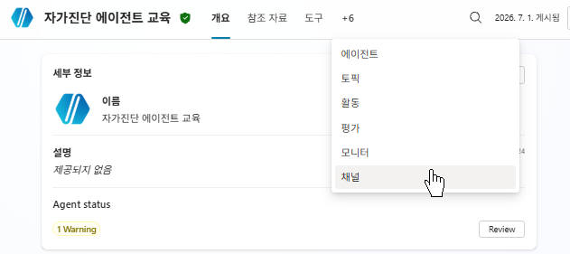

2. **게시됨**이 아니면 오른쪽 위의 게시를 선택하고, 확인 대화상자에서 다시 게시를 선택합니다.

    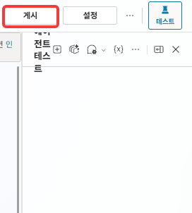

3. **닫기**를 선택합니다. 게시는 백그라운드로 진행되며 1~3분 소요됩니다. 자가진단 부록의 7단계에서 이미 게시했다면 상태가 게시됨으로 표시됩니다.

### 채널 연결

{: start="4" }
4. **채널** 탭에서 「에이전트 상태 게시됨」과 게시 일시를 확인합니다. 위쪽 배너에 「Microsoft 인증을 사용하고 있으므로 Teams, Microsoft 365 및 SharePoint 채널만 사용할 수 있습니다」가 표시됩니다.

    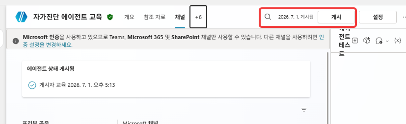

5. Microsoft 채널의 **Microsoft 365 및 Microsoft Teams** 타일을 선택합니다. 오른쪽에 구성 패널이 표시됩니다.

    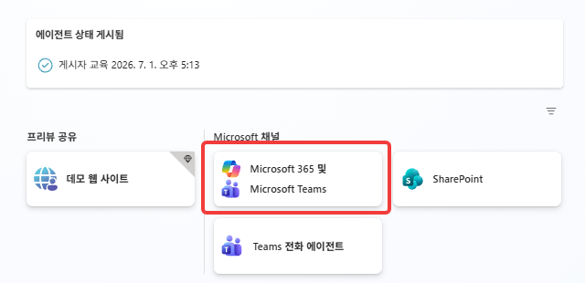

6. 구성 패널의 **Microsoft 365 켜기**에서 「Microsoft 365 Copilot에서 에이전트가 사용 가능하도록 설정」의 선택 상태를 확인합니다. 기본값은 선택입니다. 해제하면 에이전트는 Teams에서만 동작합니다.

    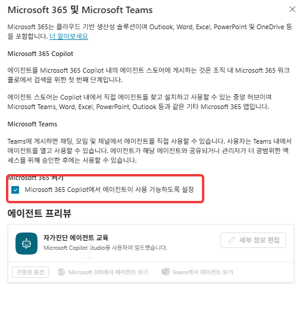

7. 패널 맨 아래의 **채널 추가**를 선택합니다.

    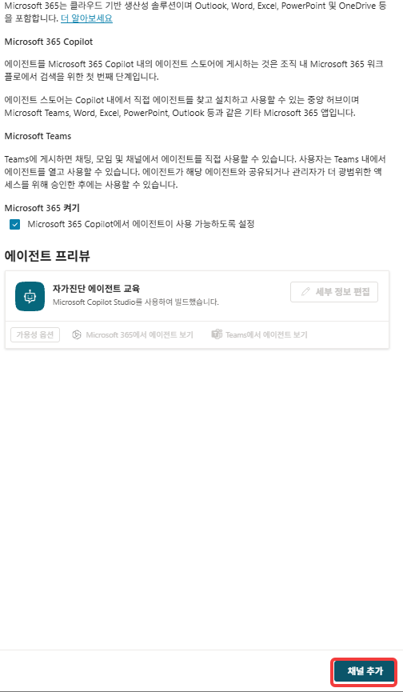

8. 「채널이 추가되었습니다」 메시지를 확인합니다.

    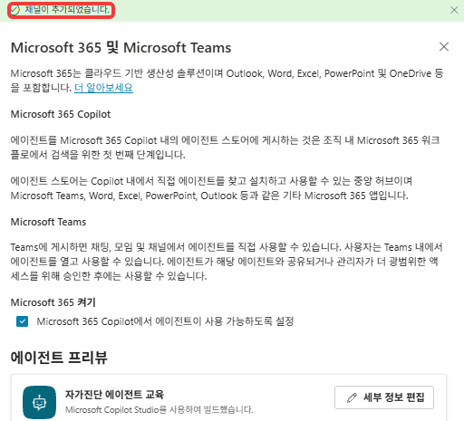

### Teams에서 확인

{: start="9" }
9. 구성 패널의 에이전트 프리뷰에서 **Teams에서 에이전트 보기**를 선택합니다. Teams가 열리고 자가진단 에이전트와의 대화가 바로 시작됩니다.

    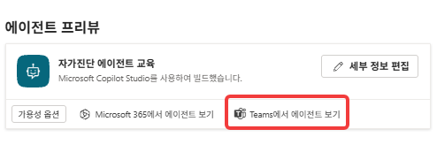

10. **1:1 채팅**에서 아래를 입력합니다.

    ```
    Copilot Studio 에서 MCP 서버를 연결할 때 인증 방식에 무엇이 있는지 MS Learn 에서 확인해줘
    ```

    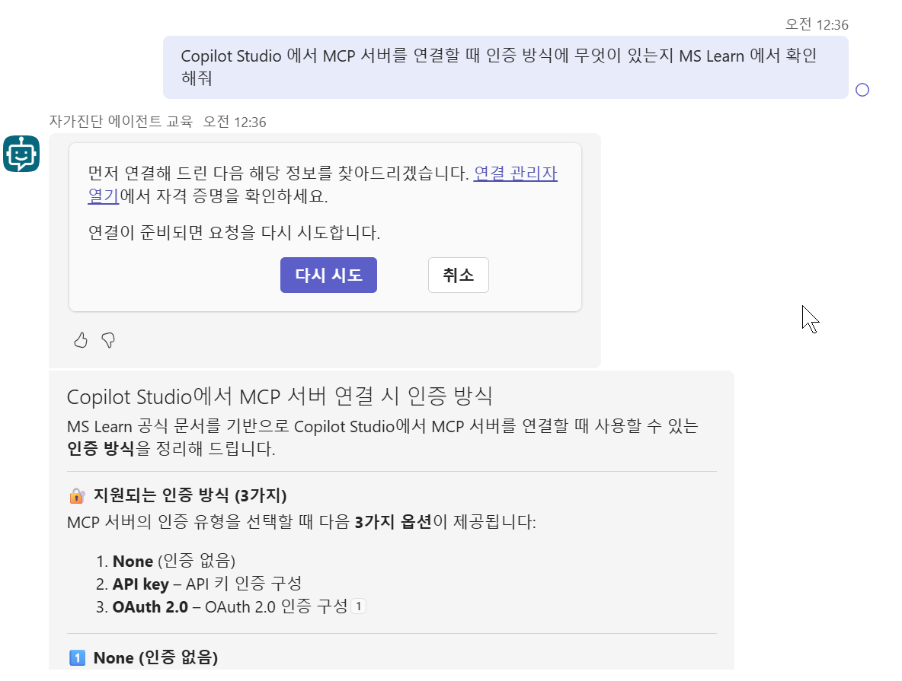

    {: .warning }
    확인은 **1:1 채팅**에서 수행합니다. 팀 채널과 그룹 채팅에서는 최종 사용자 인증이 필요한 지식(SharePoint 등)을 사용할 수 없습니다. Microsoft가 문서에 명시한 제한 사항이며, 면접관 에이전트를 같은 방식으로 배포할 때 그대로 걸립니다.

    답 대신 **「먼저 연결해 드린 다음 해당 정보를 찾아드리겠습니다」** 카드가 나오면 아래 넷을 차례로 합니다. 카드의 취소를 누르지 않습니다.

    ① 카드의 **연결 관리자 열기**를 선택합니다.

    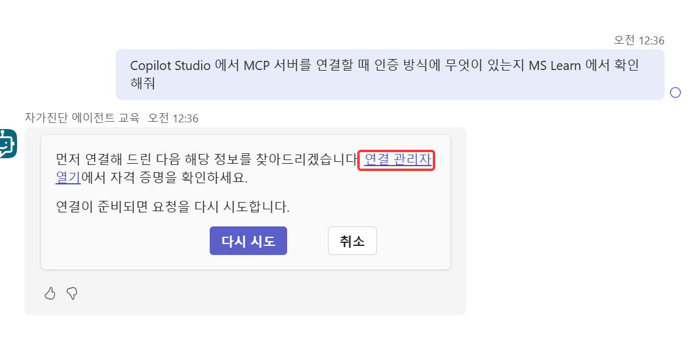

    ② 연결 관리 화면에서 MS Learn 도구가 **연결되지 않음**으로 표시됩니다. 오른쪽 **연결**을 선택합니다.

    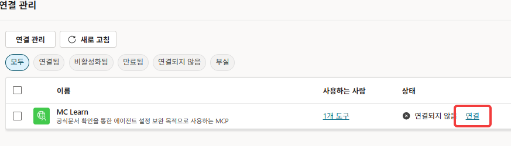

    ③ 「연결 만들기 또는 선택」에서 **제출**을 선택합니다. 인증 정보를 넣는 칸은 없습니다.

    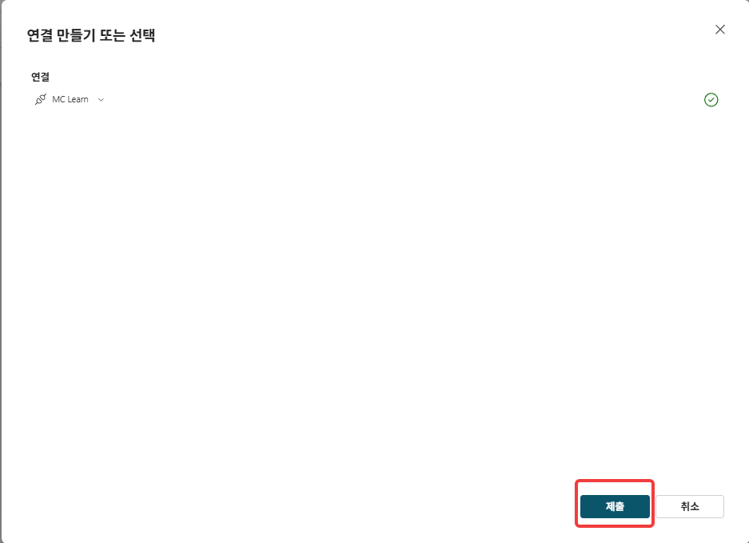

    ④ Teams 대화로 돌아와 카드의 **다시 시도**를 선택합니다. 이제 답이 나옵니다.

    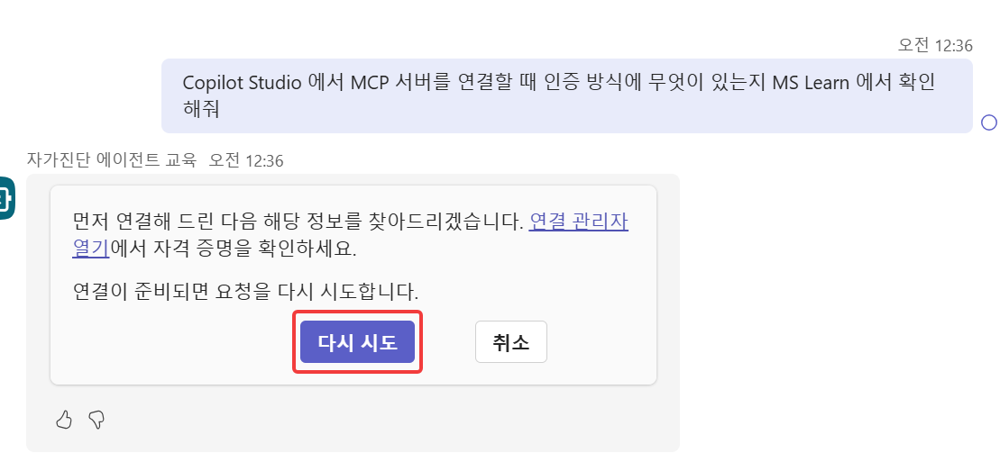

    {: .important }
    **인증이 없는 도구도 연결은 따로 만듭니다.** 자가진단 부록에서 MS Learn MCP 서버를 「인증 없음」으로 붙였는데도 이 절차가 필요합니다. 에이전트를 만든 본인 화면에서도 그렇습니다. Copilot Studio 테스트 창에서는 나지 않고 채널로 나간 뒤에 납니다.

### 사용 권한 부여

{: start="11" }
11. Copilot Studio 상단 메뉴의 점 세 개(**…**)에서 **공유**를 선택합니다.

    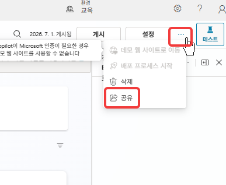

12. **새 사용자**의 「이름, 그룹 또는 이메일 추가」에 대상 사용자를 입력하고 목록에서 고릅니다.

    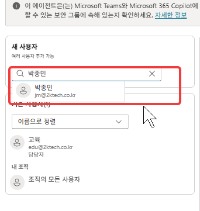

13. 오른쪽에서 그 사용자의 권한을 지정합니다. 대화만 하게 하려면 **최종 사용자 액세스**만 켭니다.

    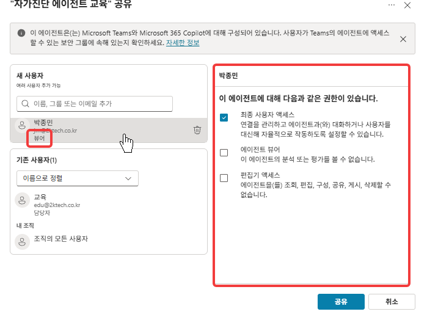

    | 권한 | 무엇을 할 수 있나 |
    |---|---|
    | 최종 사용자 액세스 | 연결을 관리하고 에이전트와 대화한다 |
    | 에이전트 뷰어 | 분석과 평가를 본다. 편집·구성·공유·게시·삭제는 하지 못한다 |
    | 편집기 액세스 | 조회·편집·구성·공유·게시까지 한다. 삭제는 하지 못한다 |

    왼쪽 사용자 아래의 역할 표시가 켠 권한에 따라 **뷰어**·**편집기**로 바뀝니다.

    {: .note }
    편집기 액세스를 켜면 그 사용자에게 **Power Automate 사용자**와 **환경 제작자** 보안 역할이 자동으로 할당됩니다. 교육 중에는 켜지 않습니다 — 대화만 확인하면 됩니다.

    {: .warning }
    창 위쪽에 「이 에이전트는 Microsoft Teams와 Microsoft 365 Copilot에 대해 구성되어 있습니다. 사용자가 Teams의 에이전트에 액세스할 수 있는 보안 그룹에 속해 있는지 확인하세요」가 뜹니다. 채널로 나간 에이전트는 공유만으로 끝나지 않는다는 안내입니다.

14. **공유**를 선택합니다. 「에이전트에 대한 공유 설정을 변경했습니다」가 뜨고 기존 사용자 목록에 그 사람이 올라옵니다.

    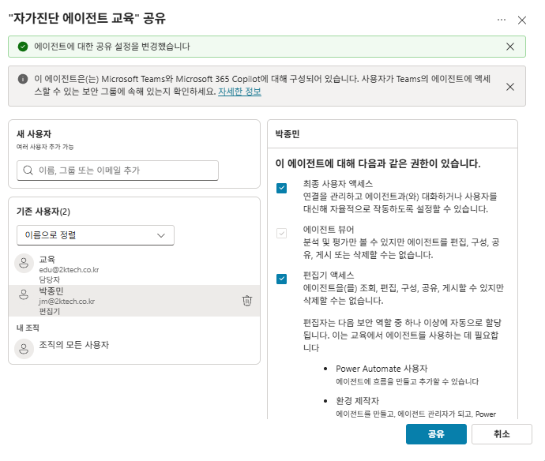

15. 채널 구성 패널의 에이전트 프리뷰에서 **가용성 옵션**을 선택합니다.

    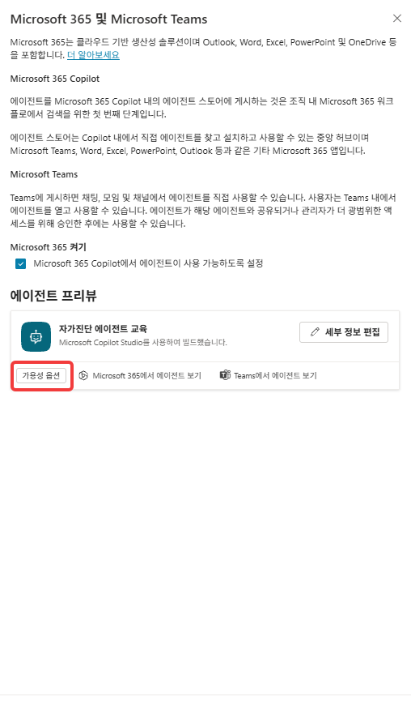

    「링크 가져오기」의 **링크 복사**를 선택해 대상 사용자에게 전달합니다. 대상 사용자는 이 링크로 자신의 Teams에 에이전트를 설치합니다.

    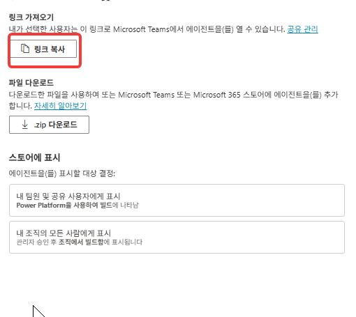

    {: .warning }
    14단계를 수행하지 않고 링크만 전달하면 설치되지 않습니다. 설치 링크는 에이전트 사용 권한이 있는 사용자만 쓸 수 있습니다.

### 연결이 따라가는지 확인

{: start="16" }
16. 대상 사용자가 자신의 Teams 1:1 채팅에서 10단계와 같은 질문을 입력합니다. 답이 나오기 전에 연결 카드가 뜨면 대상 사용자도 10단계의 ①~④를 그대로 거칩니다.

    {: .important }
    **연결은 사용자마다 따로 만들어집니다.** 에이전트를 공유해도 그 에이전트가 쓰는 도구의 연결은 각 사용자의 계정에 묶입니다. 그래서 사람이 늘 때마다 첫 사용에서 이 절차가 한 번씩 반복됩니다. 커넥터나 [흐름](./glossary.html#term-flow)을 도구로 붙인 에이전트에서는 자격 증명까지 필요해 더 번거로워집니다.

17. 만든 사람과 공유받은 사람의 화면에서 같은 답이 나오면 배포가 완료된 것입니다.

    {: .note }
    면접관 에이전트처럼 **Power Automate 흐름을 도구로 쓰는 에이전트**는 한 단계가 더 필요합니다. 에이전트를 공유해도 흐름은 공유되지 않으므로, Power Automate에서 그 흐름의 소유자에 대상 사용자를 추가합니다.

---

## 확인

- [ ] 채널 탭의 에이전트 상태가 **게시됨**이다
- [ ] Microsoft 365 및 Microsoft Teams 채널이 추가됐다
- [ ] 본인 Teams 1:1 채팅에서 자가진단 에이전트가 MS Learn 을 근거로 답한다
- [ ] 연결 카드가 나오면 연결 관리자 열기 → 연결 → 제출 → 다시 시도로 통과했다
- [ ] 대상 사용자에게 사용 권한을 부여하고 설치 링크를 전달했다
- [ ] 대상 사용자 화면에서도 같은 질문에 답이 나온다

---

## 재게시가 필요한 변경

채널 연결은 최초 1회 수행합니다. 게시는 다음 항목을 변경할 때마다 수행합니다.

- 지침(Instructions)
- 지식(Knowledge) 추가·삭제
- 토픽 생성·변경
- 커넥터·MCP 서버·흐름 연결

게시 후에도 Teams에서 진행 중이던 대화에는 이전 버전이 적용되어 있습니다. 해당 대화에 `다시 시작`을 입력하면 새 대화가 시작되며 최신 버전이 적용됩니다.

---

## 범위 밖 — 조직 전체 배포

Teams 앱 스토어의 「조직을 위해 빌드」 섹션에 에이전트를 등록하려면 관리자 승인 절차가 필요합니다. 승인 대기 시간이 있어 교육 시간 내에 완료되지 않으므로 이 부록에서는 다루지 않습니다.

실무 절차는 다음과 같습니다.

1. 채널 구성 패널 → **가용성 옵션**
2. **내 조직의 모든 사람에게 표시** 선택
3. **관리자 승인을 위해 제출** 선택
4. Teams 관리 센터에서 관리자가 승인

가용성 옵션의 「스토어에 표시」에 두 카드가 있습니다. 제출 전에 **내 팀원 및 공유 사용자에게 표시**를 해제합니다. 해제하지 않으면 앱 스토어 두 위치에 동일한 에이전트가 등록됩니다.
