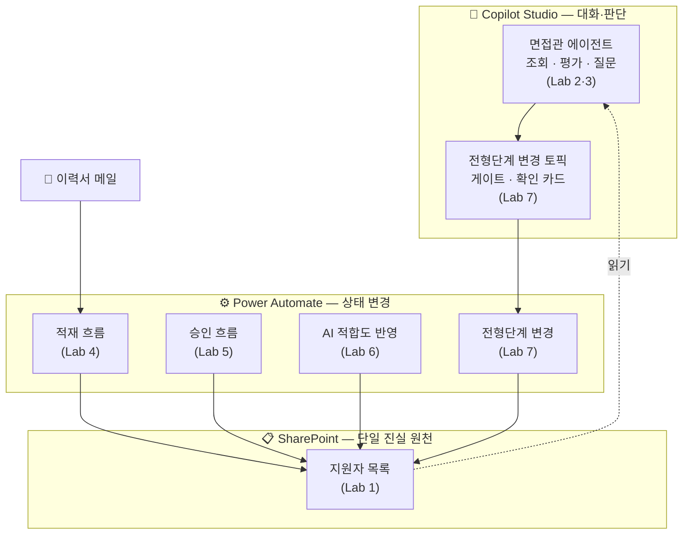

# 0. 시작하기 전에 — 오늘 쓰는 세 가지 도구 🧭

> **이 페이지의 목적**: 실습을 시작하기 전에 **"무엇을 왜 만드는지"** 를 먼저 잡습니다. 랩에서 길을 잃으면 여기로 돌아오세요.
> **예상 시간**: 15분 · 실습 없음

{: .note }
> **📊 오리엔테이션 발표자료**
>
> 강의 도입부에 함께 본 슬라이드입니다. 이 페이지는 그 내용을 **찾아보기 쉽게 펼쳐 놓은 것**이라, 복습할 때는 둘 중 편한 쪽을 보시면 됩니다.
>
> [핸즈온 인트로 슬라이드 내려받기 (pptx)](../assets/download/핸즈온%20인트로%20영상%20제거버전.pptx)

<!-- 저작 메모(학생 비노출):
     2026-07-28 신설. 고객사 요청 2번(tool 체계 설명 부재)·5번(과정이 기억 안 남) 대응.
     nav_order 2 = 초기 시연 페이지를 뺀 뒤 비어 있던 자리.
     ★ 새 주장을 만들지 않는 것이 원칙. 아래 내용은 전부 기존 본문에서 끌어올린 것:
       - "읽기는 커넥터+지침 / 상태 변경은 흐름 / 사람 확인은 토픽" = lab7.md 마지막 {: .important } (과정 총결)
       - "조회와 추론은 커넥터+지침이 흡수한다" = lab3.md 마무리
       - 동명이인·불변식 = lab6.md '왜 흐름인가'
       - 3층 분담 = lab7.md '왜 토픽인가'
     각 랩이 이 페이지의 주장을 회수하는 구조이므로, 랩 본문을 고치면 여기도 같이 볼 것.
     ⏱ 이 15분은 1부 여유(Lab 1~3 합계 50분)에서 흡수한다. 2부에는 시간을 얹지 않는다.
     ★ 오리엔테이션 pptx(assets/download/)와 내용이 대응한다 — 슬라이드 10(세 도구)·11(두 가지 질문)·19(용어)·20(랩 구성)이 이 페이지와 홈에 흩어져 있다.
       덱을 고치면 여기도 같이 봐야 한다. 특히 슬라이드 20의 "실습 합계 3시간 50분"은 index.md·README.md와 세 곳이 물려 있다.
       ⚠️ 배포본은 영상 제거버전(약 1MB)만 올린다. 영상 포함본은 22MB라 저장소에 넣지 않는다.
       ⚠️ 이 덱은 특정 고객사 전용 트랙이다 — 중간 스크린샷에 그 고객사 환경이 다수 포함되어 다른 고객사에 그대로 쓸 수 없다. 고객사별 별도 버전으로 관리할 것.

     아래 mermaid에서 PA→LIST 화살표가 SharePoint 서브그래프 테두리와 살짝 겹치지만,
     2026-07-28 브라우저 확인 결과 가독성에 지장 없어 그대로 두기로 확정. 손대지 말 것.
     mermaid는 자동 배치라 건드리면 다른 곳이 틀어지고, 빌드로는 검증도 안 된다. -->

---

## 오늘 하루를 관통하는 한 문장

{: .important }
**읽기는 커넥터+지침, 상태 변경은 흐름, 사람 확인은 토픽.**

오늘 만드는 것은 챗봇 하나가 아니라, **역할이 나뉜 파이프라인**입니다. 어떤 일을 누구에게 맡길지 — 그 경계를 손으로 그어 보는 것이 이 과정의 목표입니다.

지금은 무슨 말인지 몰라도 괜찮습니다. 이 문장은 하루가 끝날 때 여러분이 직접 확인하게 됩니다.

---

## 세 가지 도구, 세 가지 역할

| 도구 | 한마디로 | 잘하는 일 | 못하는 일 | 오늘 이걸로 만드는 것 |
|---|---|---|---|---|
| **SharePoint** | 데이터가 사는 곳 | 목록·파일을 한 군데 모아 두기. 모두가 같은 값을 본다 | 스스로 아무것도 하지 않는다 | 지원자 목록 · 이력서 보관함 (**Lab 1**) |
| **Copilot Studio** | 대화하고 판단하는 곳 | 사람 말을 알아듣고, 기준에 비춰 답하기 | 정확히 1건만 바꾸기 같은 **확정적 처리** | 면접관 에이전트 (**Lab 2·3**) · 확인 토픽 (**Lab 7**) |
| **Power Automate** | 일을 처리하는 곳 | 조건을 걸고, 순서대로, 매번 똑같이 실행 | 사람 말을 알아듣기 | 적재·승인·반영·변경 흐름 (**Lab 4~7**) |

{: .note }
**SharePoint를 [단일 진실 원천](./glossary.html#term-list)이라고 부릅니다.** 에이전트도 흐름도 각자 데이터를 따로 갖지 않고 전부 이 목록 하나를 읽고 씁니다. 그래서 누가 무엇을 바꿨든 모두가 같은 값을 보게 됩니다.

---

## 오늘 만들 전체 그림

각 상자에 **그걸 만드는 랩 번호**를 적어 뒀습니다.

**오전(1부)** 은 오른쪽 위 — 에이전트를 만들고 데이터를 **읽습니다.**
**오후(2부)** 는 아래쪽 — 그 데이터가 **어떻게 들어오고 바뀌는지**를 만듭니다.

---

## 언제 무엇을 쓰나 — 오늘의 판단 기준

실습 중 가장 자주 나오는 질문입니다. **"이건 지침으로 될까, 흐름을 만들어야 할까?"**

| 하려는 일 | 답 | 왜 | 확인하는 랩 |
|---|---|---|---|
| 목록을 **읽어서** 보여 주기 | 커넥터 + 지침 | 흐름 없이도 충분히 된다 | Lab 3 |
| 기준에 비춰 **평가·추론**하기 | 커넥터 + 지침 | AI가 잘하는 일 | Lab 3 |
| 값을 **바꾸기** (전형단계·적합도) | 흐름 | 조건을 **결정적으로** 걸어야 한다 | Lab 6 |
| 바꾸기 전에 **사람 확인** 받기 | 토픽 (+ 흐름) | 대화로 묻고, 확정되면 흐름이 처리 | Lab 7 |

**왜 바꾸는 일은 흐름이어야 하나요?** 에이전트에게 직접 맡기면 이런 게 무너집니다.

- **동명이인** — 이름이 같은 지원자가 둘이면 누구를 바꿀지 불분명합니다
- **순서 보장** — 요약이 아직 승인되지 않았는데 적합도가 먼저 써질 수 있습니다

에이전트는 **확률적으로** 동작하고, 흐름은 **매번 똑같이** 동작합니다. 그래서 "전부 되거나 전부 안 되거나"가 중요한 일([트랜잭션](./glossary.html#term-transaction))은 흐름이 맡습니다.

{: .note }
Lab 3을 마치면 **"흐름 없이 어디까지 되는지"** 를 보게 되고, Lab 6에서 **"그래도 흐름이어야 하는 이유"** 를 직접 겪게 됩니다. 두 랩을 연결해서 기억하세요.

---

## 사람은 어디에 개입하나 — HITL 두 패턴

AI에게 일을 맡기되 **결정은 사람이 내립니다.** 오늘 그 방법을 두 가지로 만들어 봅니다.

| 패턴 | 어떻게 | 어디서 | 만드는 랩 |
|---|---|---|---|
| **비동기** [HITL](./glossary.html#abbr-hitl) | 항목이 생기면 승인 카드가 **찾아온다** | Teams·메일 | Lab 5 |
| **대화형** HITL | 챗봇이 **되물어보고** 확인 카드를 띄운다 | 에이전트 대화창 | Lab 7 |

같은 "사람 끼워 넣기"인데 결이 다릅니다. 어디에 무엇이 맞는지가 오늘의 두 번째 질문입니다.

---

## 끝나면 손에 남는 것

- 지원자 42명이 들어 있는 **내 SharePoint 목록**
- 조회·평가·면접질문이 되는 **내 면접관 에이전트**
- 메일이 오면 자동으로 요약·적재하는 **흐름**
- 승인·적합도 반영·전형단계 변경까지, **사람이 끊는 지점이 설계된 파이프라인**

그리고 무엇보다 — **"이 일은 에이전트, 저 일은 흐름"** 을 스스로 가를 수 있는 감각.

---

## 실습 전 확인

- [ ] Copilot Studio에 접속되고, 우측 상단 환경이 **교육용 환경**이다
- [ ] 왼쪽 메뉴에 **솔루션**이 보이고 `2026 Agent Intermediate Solution`이 있다
- [ ] 낯선 말이 나오면 [용어집](./glossary.html)을 열어 둔다

{: .note }
**막히면 손을 드세요.** 각 랩 끝에는 **완성 신호**가 있습니다 — 그게 보이지 않으면 다음으로 넘어가지 말고 알려 주세요. 뒤 랩은 앞 랩의 결과물 위에 쌓입니다.

[Lab 1 시작하기 →](./lab1.html){: .btn .btn-purple }
