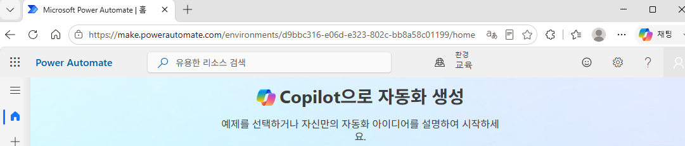
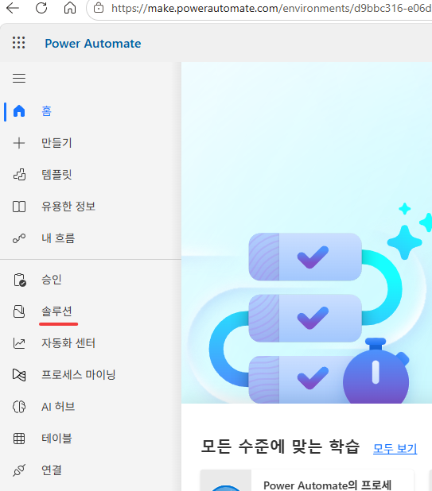
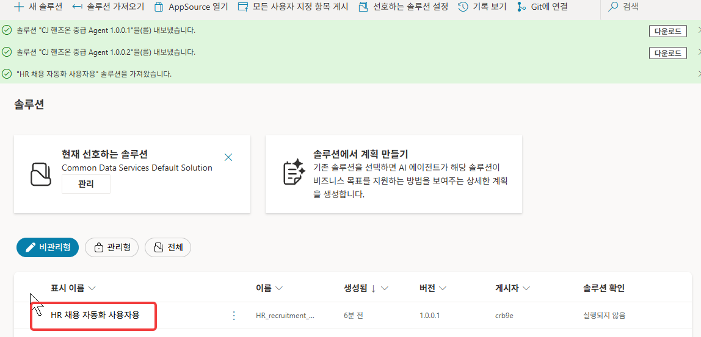
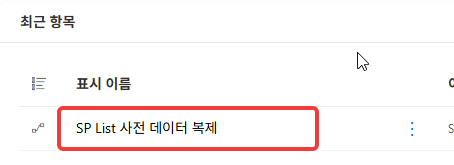
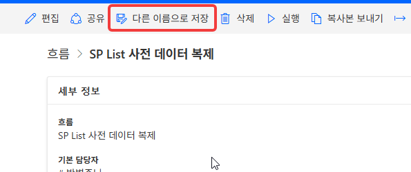
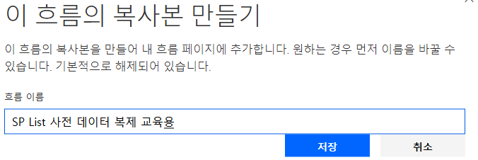
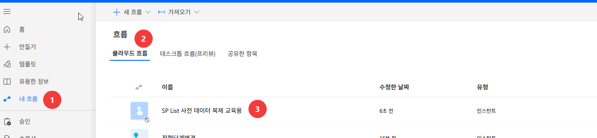
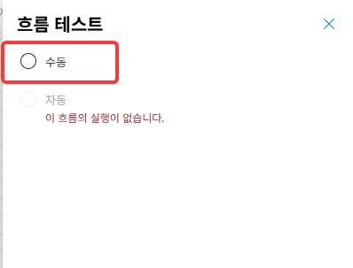
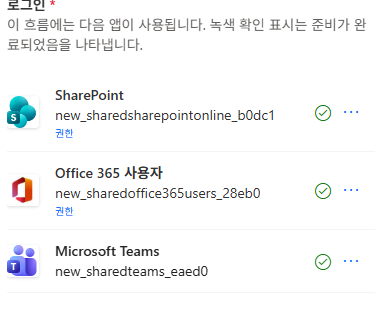

# Lab 1. 환경 초기화 📦

> **이번 랩 완성물**: 지원자 42명과 이력서 파일이 들어 있는 **내 SharePoint 목록**
>
> **예상 시간**: 10분 · **완성 신호**: SharePoint **지원자** 리스트에 지원자 42명이 채워져 있음

<!-- 저작 메모(학생 비노출):
     ★ 2026-06-29 전면 재작성. zip 배포 폐기 → 공용 솔루션에서 흐름 다른 이름으로 저장 방식으로 전환.
     ★ 솔루션명 = "2026 Agent Intermediate Solution" (사전 배포, 교육 환경에 고정).
     ★ 흐름 1개 = "SP List 사전 데이터 복제" (리스트 생성 + 데이터 42명 적재 + PDF 적재 통합).
     ★ 수강생은 해당 흐름을 "다른 이름으로 저장" → "SP List 사전 데이터 복제 (본인이름)" 으로 소유권 이전.

     ═══ 환경 프로비저닝 구조 (2026-07-31 정리) ═══
     흐름은 두 갈래다. 헷갈리지 말 것.
       [수강생용] "SP List 사전 데이터 복제" — Lab 1에서 각자 복사해 실행. 리스트 생성 + 지원자 42명 적재.
       [강사 사전준비용] 별도 3개 — 수강생에게 노출하지 않는다.
         1) SP Site 자동생성
         2) SP List 자동생성
         3) SP List 데이터 채우기 (리스트만 — 이력서 원본 PDF는 포함하지 않음)
     ★ 이력서 원본(PDF) 적재는 현재 자동화되어 있지 않다.
       현재 방식(A) = 공용 소스 라이브러리에 원본을 두고 거기서 가져오는 형태. 최초 1회 수동 준비가 남아 있다.
       설계 목표(B) = 흐름이 `assets/download/지원자 이력서 샘플 원본.zip`을 풀어 적재해 수동 단계를 0으로.
       B로 가기 전까지는 강사가 사이트 생성 후 이력서 원본을 직접 채워야 한다.
     ⚠️ 이게 왜 중요한가 — lab3.md 본문이 "시드 지원자도 원문(이력서 PDF)이 함께 적재돼 있다"고 전제하고
       학생에게 `정재혁 이력서 원문까지 보고 면접 질문 만들어줘`를 시킨다. PDF가 없으면 그 자리에서 실패한다.
       Lab 3의 학습 포인트인 "2단 구조(요약=빠름 / 원문=느림)" 대비도 성립하지 않는다.
       ※ lab3.md:16 메모의 "시드가 PDF없음" 기술은 본문과 상충한다 — 실제 상태 확인 후 한쪽으로 정리할 것.

     ═══ 수강생 권한·라이선스 ═══
     Power Automate · Copilot Studio · SharePoint 사이트 접근 · 환경 메이커(Environment Maker).
     ★ SP 콘텐츠 승인(Approve) 권한은 불필요하다 — 그 권한이 사이트 관리자급이라 교육 대상자에게 주기 어려워서
       SP 내장 승인을 버리고 별도 Choice 컬럼(요약승인상태)으로 전환한 것이다. 상세는 lab5.md 저작 메모 참조.
     ★ 2026-07-28: 환경 변수(SPSiteUrl) 사용 폐기 → 사이트 주소는 전 랩에서 값 직접 입력(https://2ktech.sharepoint.com/sites/edulab).
       사유: CS가 환경 변수 값을 늦게 인식하거나 못 읽는 사례 다수. 시티즌 대상은 안정성 우선.
     ★ 실행 UI 라벨(테스트→수동→실행)은 촬영 시 최종 확인. -->

{: .time }
**10분.** 직접 만드는 건 적습니다 — 준비된 흐름을 내 것으로 복사해 한 번 실행하면 끝납니다.

**왜** — 오늘 모든 랩이 읽고 쓸 **내 데이터 창고**를 먼저 세웁니다. 여기가 없으면 뒤 랩은 다룰 데이터가 없습니다.

### 이번 랩 새 용어

| 용어 | 화면에서 | 한 줄 |
|---|---|---|
| 솔루션 | Power Automate 왼쪽 메뉴 **솔루션** | 오늘 만드는 흐름·에이전트를 담는 상자. **같은 상자에 모아야** 나중에 서로 도구로 붙이기 쉽다 |
| [목록 (List)](./glossary.html#term-list) | SharePoint 사이트 안 | 행·열로 된 데이터 저장소. 지원자 한 명이 한 행 |
| [내부 이름](./glossary.html#term-internal-name) | 컬럼 설정 | 표시 이름과 별개인 **시스템 식별자**. 흐름은 이 이름으로 컬럼을 찾는다 |
| [콘텐츠 승인](./glossary.html#term-content-approval) | 목록 설정 | SharePoint **내장** 승인 기능. Lab 5에서 쓰는 `요약승인상태` 컬럼과는 별개다 |

---

## 단계

1. 브라우저에서 [https://make.powerautomate.com](https://make.powerautomate.com/) 으로 이동합니다. 우측 상단 **환경 선택기**를 클릭해 **2026 에이전트 교육 및 지원**을 선택합니다.
    
    

2. 왼쪽 메뉴에서 **솔루션**을 클릭합니다.

    

3. **`2026 Agent Intermediate Solution`** 솔루션을 찾아 클릭해 엽니다.

    

4. 솔루션 안에서 **`SP List 사전 데이터 복제`** 흐름을 찾아 클릭합니다.

    

5. 흐름 관리 화면에서 **다른 이름으로 저장**을 선택하고 **`SP List 사전 데이터 복제 (본인이름)`** 으로 입력한 뒤 저장합니다.

    

    

    {: .note }
    **다른 이름으로 저장**하면 이 흐름의 소유자가 내 계정이 됩니다. 원본 흐름은 그대로 남아 다른 수강생도 같은 방식으로 복사할 수 있습니다.

6. 내 흐름 > 클라우드 흐름 > 저장된 흐름 클릭 후 흐름이 열리면 **설정**을 클릭하여 흐름을 활성화 합니다. 이후 **편집**을 클릭해 디자이너 화면에 진입합니다. 우측 상단 **테스트 → 수동 → 실행**을 클릭합니다.
    
    {: .important }
    복사한 클라우드 흐름을 활성화하지 않으면 흐름 테스트를 수행할 수 없습니다. 반드시 **활성화 후**에 테스트를 수행합니다.

    
    

    

7. 테스트는 수동선택, 연결 확인 후 **`생성할 리스트 이름을 입력`**합니다. 생성 실행이 **성공**으로 끝나는지 확인합니다 (각 단계에 초록 체크).

    
    
    

    {: .important }
    이때 지정한 리스트 이름이 오늘 교육중 사용하게 될 리스트 이름입니다. 타인과 겹치지 않게 본인의 이름을 넣어서 생성하세요. 

8. 새 탭에서 교육용 **SharePoint 사이트**로 이동해 내 **지원자** 리스트를 엽니다. 행이 **42개** 채워져 있는지 확인합니다.

    [에듀랩 SharePoint 사이트 콘텐츠 링크](https://2ktech.sharepoint.com/sites/edulab/_layouts/15/viewlsts.aspx)

    

    {: .important }
    이곳에 생성한 리스트 이름과. 유형 `목록`을 확인하시고 사전데이터 42인이 잘 보이는지 테스트해주세요.

---

## 확인

- [ ] `SP List 사전 데이터 복제 (본인이름)` 흐름이 내 소유로 저장되었다
- [ ] 흐름 실행이 성공해 지원자 42명이 채워졌다

{: .important }
방금 한 일 — **기존 흐름을 복사해 내 환경에 데이터를 세팅했다** — 오늘 실습에 쓸 지원자 42명이 준비됐습니다. Lab 2부터 이 데이터를 가지고 에이전트를 만듭니다.
