# Lab 4. 적재 흐름 📥

> **이번 랩 완성물**: Outlook 계정 없이(또는 Outlook 을 사용하지 않는 환경에서), 흐름을 **수동 실행**해 이력서를 AI가 요약·구조화하여 SharePoint에 적재하는 흐름
> **예상 시간**: 40분 · **완성 신호**: 흐름을 수동 실행하면 **본인 목록**에 새 항목이 생긴다

**이력서 파일을 흐름에 직접 업로드해 적재합니다.** 메일함을 거치지 않으므로 Outlook 계정이 없어도 됩니다. **본인 지원자 목록에 항목 1건**.

{: .time }
**40분 타이머.** Outlook 폴더·규칙 설정이 빠지는 대신, 트리거 자체를 직접 설계합니다.

---

## 이번 랩은

**왜** — 이전랩에서 처리한 지원자 데이터가 **어떻게 목록에 들어왔는지**를 직접 만듭니다. 아웃룩 메일 수신 트리거가 지원되지 않는 상황을 대비한 랩입니다. **메일 대신 사람이 직접 파일을 업로드** 하여 흐름을 실행합니다.

**어디쯤** — 파이프라인의 **맨 앞**입니다. 


### 이번 랩 새 용어

| 용어 | 화면에서 | 한 줄 |
|---|---|---|
| 트리거 | 흐름 맨 위 첫 상자 | 흐름을 **깨우는** 사건. 여기서는 "사람이 실행 버튼을 누르면" |
| 고급 매개 변수 | 노드 안 접힌 영역 | 평소엔 숨어 있는 추가 설정. **체크한 것만** 입력 칸으로 나타남 |
| 동적 콘텐츠 | 칸에 `/` 입력 시 표시되는 목록 | **앞 단계 노드의 결과**를 다음 노드에서 인식하는 방법 |
| fx | 칸 오른쪽 `fx` 버튼 | 값을 **계산해서** 넣고 싶을 때 여는 수식 편집기 |
| 칩 | 칸에 저장되는 알약 모양 태그 | 동적 콘텐츠, 수식을 넣으면 생기는 결과물 |
| [AI Builder](./glossary.html#term-ai-builder) | 작업 추가 → 프롬프트 실행 | 흐름 안에서 AI를 부르는 부품 |

---

## 준비

> [박도윤 지원자 이력서 샘플](../assets/download/추가이력서샘플/박도윤.pdf)
>
> [송지훈 지원자 이력서 샘플](../assets/download/추가이력서샘플/송지훈.pdf)
>
> [이진우 지원자 이력서 샘플](../assets/download/추가이력서샘플/이진우.pdf)
>
> [이하나 지원자 이력서 샘플](../assets/download/추가이력서샘플/이하나.pdf)

- 테스트용 **신규 지원자 이력서 PDF**(강사 제공, 시드 10명과 다른 인물)를 준비해 둡니다. 

---

## 단계

1. Copilot Studio 왼쪽 메뉴 **흐름**에서 **+ 새 에이전트 흐름**을 클릭합니다.

    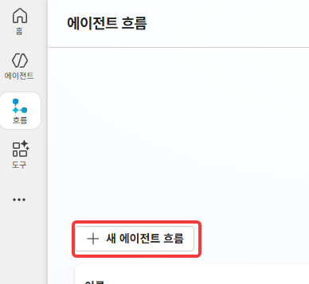

2. 트리거 검색창에 `수동으로 흐름 트리거`(Manually trigger a flow)를 입력하고 선택합니다.

    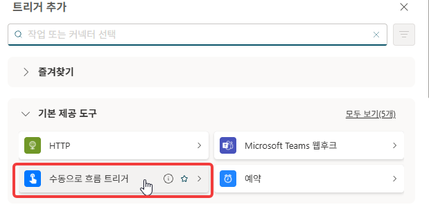

3. 트리거에서 **+ 새 매개변수 추가**(Add an input)를 눌러 입력을 2개 만듭니다.

    - **파일** 형식 입력 → 제목 `이력서원본`, 설명 `이력서 원본 파일을 지정해주세요`
    - **이메일** 형식 입력 → 제목 `이메일`, 설명 `이력서 승인 거부시 수신할 이메일 주소를 입력하세요`

    
    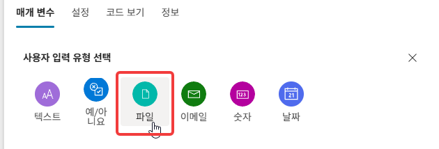
    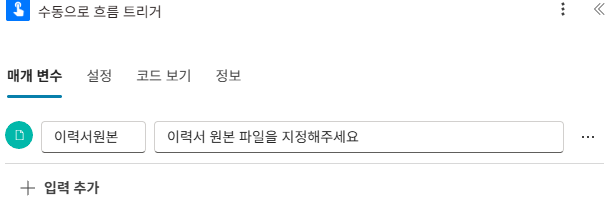
    

    {: .important }
    흐름을 실행하는 사람이 이 2개 입력에 파일과 이메일을 직접 입력합니다.

4. 오른쪽 위 **저장**을 클릭하고, 이름 입력 창에 `적재 흐름(수동 트리거)`를 입력합니다.

    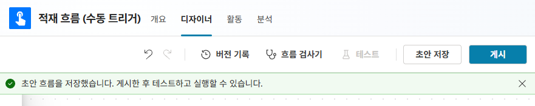

5. 트리거 아래 **+ 작업 추가** → AI Builder **프롬프트 실행**을 추가합니다.

    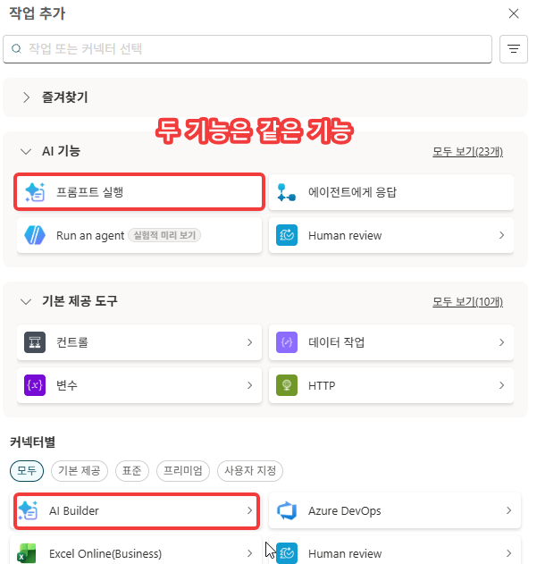

6. AI Builder **연결**을 본인 계정으로 연결합니다.

    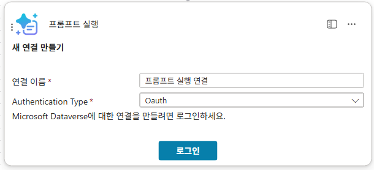

7. **프롬프트** 드롭다운에서 **새 사용자 지정 프롬프트**를 선택합니다. 이후 지침에 아래 내용을 넣습니다. (이 프롬프트의 내용은 아래 참조)


    {: .note }
    **제공 프롬프트 내용 (참조)** — 비정형 이력서 → 정형 필드로 변환하는 추출기입니다.
    ```
    당신은 이력서 분석 전문가입니다.
    첨부된 이력서 문서를 분석하여 아래 JSON 형식으로만 출력하세요.

    ### 추출 규칙:
    - 지원자명: 이력서에서 이름 추출
    - 지원직군: [영업/마케팅, 기획/전략, 인사/HR, 재무/회계, IT/개발, 물류/SCM, 고객서비스, 기타] 중 하나
    - 경력사항: [신입, 1~3년, 3~5년, 5년 이상] 중 하나
    - 이력서요약: 핵심 경력·강점을 200자 내외로. 정량 수치(%, 금액, 건수)는 일반화 말고 그대로 보존
    ### 출력 형식:
    { "지원자명":"", "지원직군":"", "경력사항":"", "이력서요약":"" }
    ```
    경력사항·지원직군이 **고정된 선택지로만 출력**되므로, 뒤에서 선택형 컬럼(CareerLevel)에 그대로 매핑해도 값이 일치합니다. 모델은 **GPT-4.1 mini**.

    이후 프롬프트의 이름을 입력합니다.

    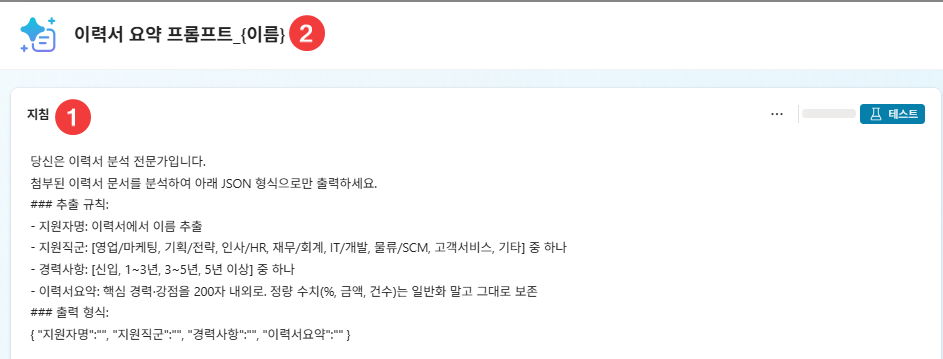

8. 지침 아래쪽에 커서를 위치하고 `이력서 원본 :` 을 타이핑합니다. 이어서 `/`를 입력하면 나타나는 목록에서 **이미지 또는 문서**를 선택합니다.

    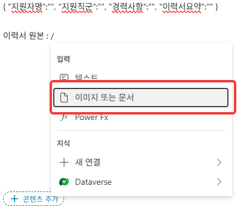

    **문서 입력** 패널에서 **이름**을 `Resume`로 지정합니다. **샘플 데이터**에 [이력서 샘플](../assets/download/추가이력서샘플/박도윤.pdf)을 업로드해 두면 다음 단계에서 바로 테스트해 볼 수 있습니다.

    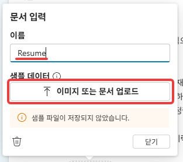

    지침에 `Resume` 칩이 삽입된 모습입니다.

    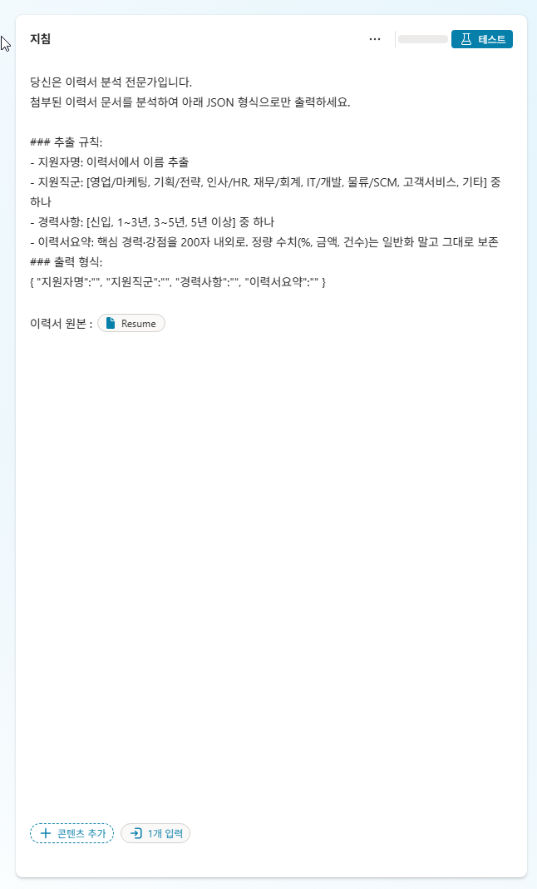

    이후 **출력**을 **JSON**으로 변경하고 **테스트**로 결과를 확인한 뒤, 저장해서 디자이너로 돌아옵니다.

    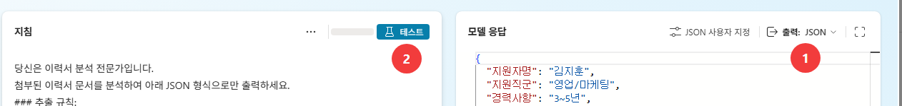

    <!-- 저작 메모(학생 비노출):
         2026-07-28 — 원본 lab4.md 13번과 동일 블록. 신규 13b·13c 반영해 함께 갱신. 한쪽만 고치지 말 것.
         ※ 이 주석은 반드시 4칸 들여쓸 것 — 컬럼 0에 두면 순서 목록이 끊겨 이후 단계 번호가 1부터 다시 렌더된다. -->

    

9. 프롬프트의 **Resume** 입력 칸에 트리거의 **이력서원본 콘텐츠**(파일 콘텐츠) 칩을 넣습니다.

    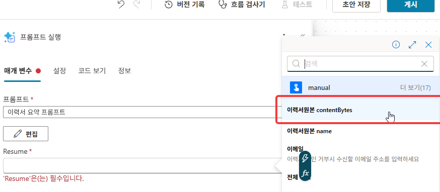


10. `Sharepoint` > `파일 만들기`를 클릭합니다. **사이트 주소** 드롭다운에서 **`에듀랩`** 를 고릅니다.

    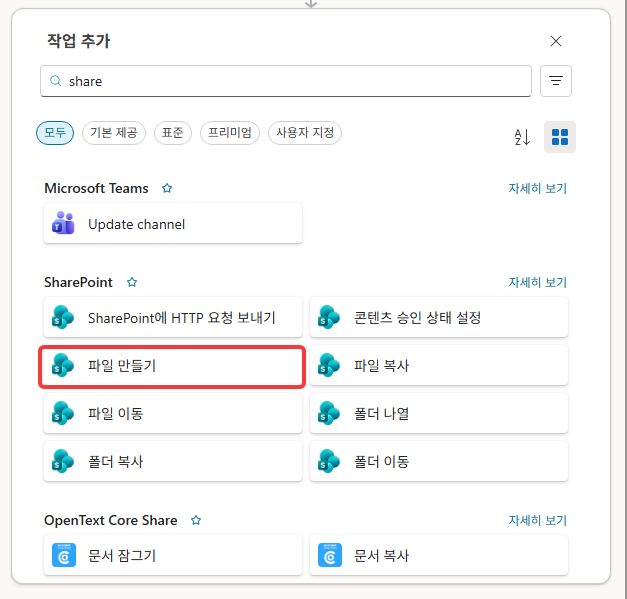


11. 폴더 경로는 `DocLib` > `이력서샘플` 을 지정합니다.

    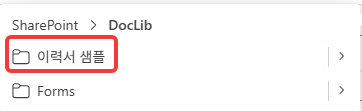

12. **파일 이름** 칸의 **fx**를 열고 아래 식을 붙여넣은 뒤 **추가**합니다.

    ```
    concat(formatDateTime(utcNow(),'yyyyMMdd_HHmmss'), '_', substring(guid(),0,8), slice(triggerBody()?['file']?['name'], lastIndexOf(triggerBody()?['file']?['name'], '.')))
    ```

    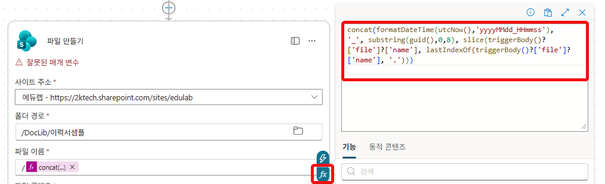

    {: .important }
    **원본 파일명을 쓰지 않습니다.** 원본 파일명의 공백이나 한글이 있으면 링크가 잘 작동하지 않을 확률이 있습니다. `{수신시각}_{GUID8}{확장자}`로 공백 없는 고유한 이름을 만듭니다. 중복된 파일명이 없도록 Guid를 사용합니다.

13. **파일 콘텐츠** 칸에 `/`를 입력하고 트리거의 **이력서원본 콘텐츠**를 넣습니다.

    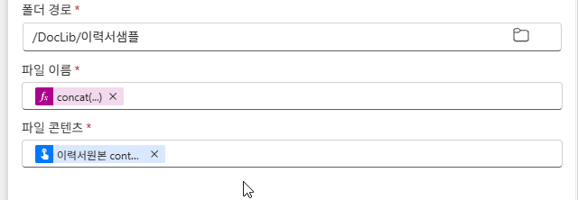

    


14. **+ 작업 추가** → SharePoint **항목 만들기**를 추가합니다.

    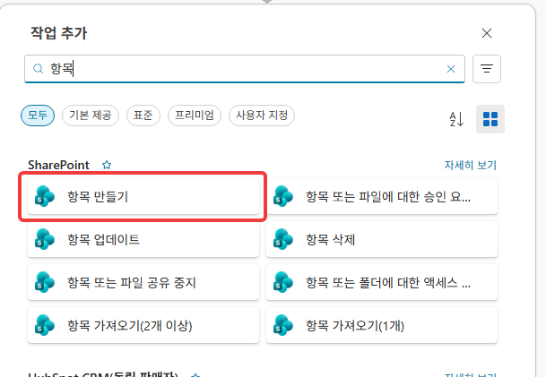

15. **사이트 주소** 드롭다운에서 **`에듀랩`** 를 고르고, **목록 이름** = **본인 지원자 목록**을 선택합니다.

    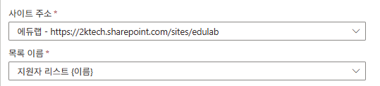

16. 고급 매개 변수를 확장하여 필요한 데이터를 편집합니다. 제목, 지원자이름, 이메일, 지원직군, 경력사항, 이력서요약, 이력서링크를 체크합니다.

    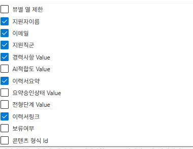

    {: .note }
    **제목을 포함해 여기서 체크한 컬럼만 입력 칸으로 나타납니다.** 이어지는 17~23번은 이렇게 나타난 칸을 하나씩 채우는 과정입니다.

17. **제목(Title)** 칸의 **fx**를 열고 아래를 입력합니다. `지원자명`·`지원직군`은 식 안에서 **동적 콘텐츠 칩**으로 삽입합니다(키보드 텍스트 아님). `지원자명`, `지원직군`은 `프롬프트 실행` 결과로 나온 값입니다. 칩을 추가하면 인코딩 처리가된 테스트가 나오므로 이하 fx함수의 정확한 위치에 잘 배치해야합니다.

    ```
    concat('[', formatDateTime(utcNow(),'yyyy-MM-dd'), ']', «지원자명», '_', «지원직군»)
    ```

    {: .note }
    **이 식이 하는 일** — 오늘 날짜와 AI가 뽑은 이름·직군을 이어 붙여 제목을 만듭니다. 결과는 `[2026-07-28]홍길동_IT/개발` 같은 모양이 됩니다. 목록에서 **정렬하면 접수일 순**이 되고, 제목만 봐도 누가 어느 직군인지 보입니다.

    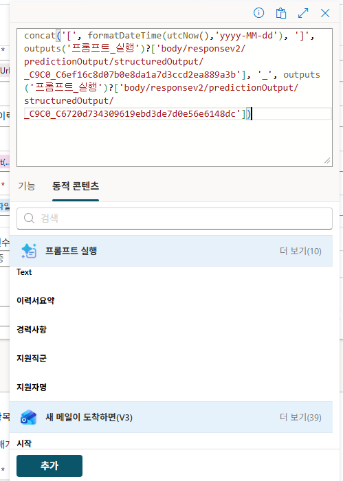

18. **지원자이름** 칸에 `/` → `지원자명` 칩을 넣습니다.

    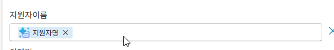

19. **이메일** 칸에 `/` → `이메일` 칩을 넣습니다.

    {: .note }
    이메일 칸에는 트리거에서 받은 **이메일 입력값**을 그대로 사용합니다. 메일 발신자 값을 변환해 쓰지 않으므로 값이 정확합니다.

    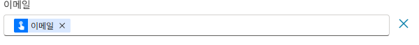

20. **지원직군** 칸에 `/` → `지원직군` 칩을 넣습니다.

    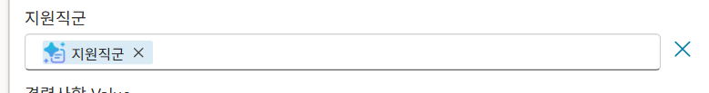

21. **경력사항** 칸에 `/` → `경력사항` 칩을 넣습니다. (프롬프트가 신입/1~3년/3~5년/5년이상 중 하나로 고정 출력 → 선택 컬럼과 일치)

    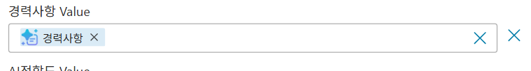

22. **이력서요약** 칸에 `/` → `이력서요약` 칩을 넣습니다.

    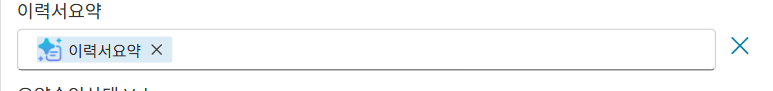

23. **이력서링크** 칸의 **fx**를 열고 아래 식을 입력합니다. (사이트 URL + 파일 만들기가 반환한 경로)

    ```
    concat('https://2ktech.sharepoint.com/sites/edulab', outputs('파일_만들기')?['body/Path'])
    ```

    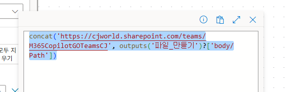

24. 채워진 칩을 확인합니다.

    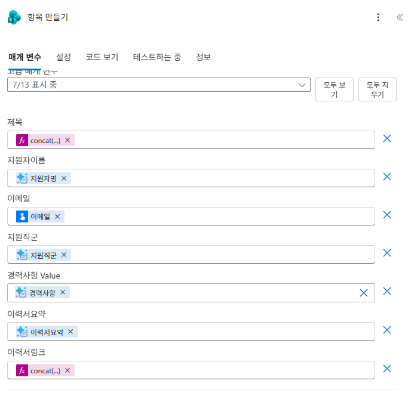

    {: .important }
    **✅ 여기까지 점검** — 17~23번에서 채운 칸이 **7개**(제목·지원자이름·이메일·지원직군·경력사항·이력서요약·이력서링크) 모두 비어 있지 않아야 합니다. 빈 칸이 있으면 그 컬럼만 조용히 비어 적재됩니다. 특히 **제목**과 **이력서링크**는 `fx` 수식이고 나머지는 칩입니다 — 수식 자리에 칩이, 칩 자리에 글자가 들어가지 않았는지 확인하세요.


25. 오른쪽 위 **저장**을 클릭합니다. 이후 **게시**를 클릭합니다

    


26. 흐름 세부 정보 화면에서 **테스트**(또는 **흐름 실행**)를 클릭하고 **수동**을 선택합니다. 준비한 이력서 PDF를 **이력서원본**에 업로드하고, **이메일**에 본인 주소를 입력한 뒤 실행합니다.

    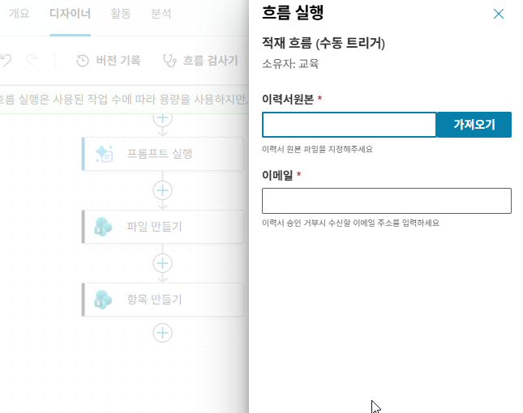

27. 흐름의 **실행 기록**에서 성공으로 수행했는지 확인합니다.

    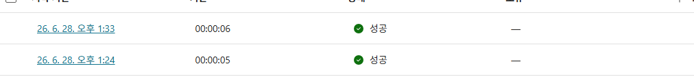

28. **본인 지원자 목록**을 열어 **새 항목**이 생겼는지 확인합니다(요약·링크 채워짐, 상태 **보류 중**).

    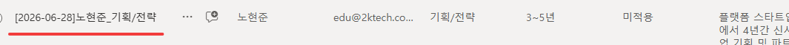


---

## 확인

- [ ] 수동 트리거 입력 2개(이력서원본=파일, 이메일=이메일)가 필수로 설정됐다
- [ ] 흐름이 게시됐다(트리거 → AI 프롬프트 → 파일 만들기 → 항목 만들기, **For each 없음**)
- [ ] 파일 업로드 + 이메일 입력으로 수동 실행했고 성공했다
- [ ] 본인 목록에 새 항목이 생겼다(요약·링크 채워짐, 요약승인상태 **승인대기**)

{: .important }
**이력서요약**이 이후 적합도 평가의 근거입니다. Lab 5에서 사람이 이 요약을 검토·승인합니다.
