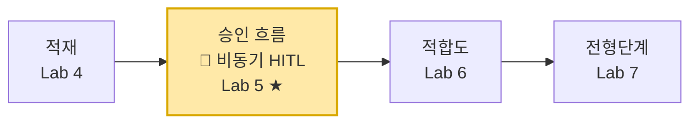

# Lab 5. 승인 흐름 ✅

> **이번 랩 완성물**: 지원자 항목이 생기면 담당자에게 승인 카드가 발송되고, 승인/거부 결과가 반영되는 흐름
> **예상 시간**: 40분 · **완성 신호**: 보류 중 지원자를 승인하면 상태가 **승인됨**으로 바뀐다

<!-- 저작 메모(학생 비노출):
     - v1 u2-1~u2-4 + PA-02 트러블슈팅 리포트 회수(2026-06-22). 빌드 위치 = CS 흐름.
     - 자격증명: 전부 학생 본인. 환경 = 1사이트 / 리스트 개별 → 트리거 충돌 없음(Author 조건 불요).
     - ★ 수강생에게 Approve(SP 콘텐츠 승인) 권한은 필요 없다. 2026-07 CJ 실측 결과 SP 표준 승인을 쓰려면
       사이트 관리자에 준하는 권한이 있어야 하는데, 교육 대상자에게 그 권한을 주는 경우가 드물다.
       그래서 SP 내장 승인(OData__ModerationStatus)을 버리고 별도 Choice 컬럼(요약승인상태)으로 전환했다.
       이 랩의 Approvals 커넥터는 '승인 카드 발송·응답 수신'만 담당하고, 결과 기록은 일반 항목 업데이트로 한다.
       (2026-07-31: 본 줄에 "Approve 권한 필요(CJ 요청서 #2)"라 적혀 있던 것을 정정. 전환 이전의 낡은 기술이었음)
     - 수강생 필요 권한/라이선스 = Power Automate · Copilot Studio · SharePoint 사이트 접근 · 환경 메이커(Environment Maker).
     - 사이트 = 값 직접 입력(https://cjworld.sharepoint.com/teams/M365CopilotGOTeamsCJ). 승인 형식 = 표준 '승인/거부-첫번째로 응답'. (2026-07-28 환경 변수 폐기)
     - 카드 Markdown 5규칙. 거부 사유 = comments 폴백(approverResponse 오참조 금지). HTML 메일은 별표 제거.
     - 비동기 HITL = 카드 UI 통제 불가(본문 md만) ↔ 대화형(Lab7)은 지침 강제.
       2026-07-28: 본 줄이 "대화형(Lab6)"으로 잘못 적혀 있던 것을 정정. 본문(:101, :208)은 대화형 HITL을 Lab 7로 지목한다. -->

{: .time }
**40분 타이머.** **[비동기 HITL](./glossary.html#abbr-hitl)** — 사람의 검토를 시스템 이벤트에 끼워 넣는 패턴입니다.

---

## 이번 랩은

**왜** — Lab 4에서 **AI가 요약한** 이력서 정보가 목록에 들어왔습니다. 그 요약이 **믿을 만한지 사람이 판정**하는 관문을 세웁니다. 이게 없으면 AI가 잘못 요약한 내용이 그대로 평가의 근거가 됩니다.

**어디쯤** — 적재와 평가 **사이**입니다. 여기를 통과한 데이터만 하류로 흐릅니다.



**앞 랩과의 연결** — Lab 3에서 지침에 적었던 **"승인된 지원자만 보여준다"** 가 여기서 비로소 채워집니다. 지금까지는 시드 지원자가 전부 승인 상태라 그 효과가 보이지 않았습니다.

### 이번 랩 새 용어

| 용어 | 화면에서 | 한 줄 |
|---|---|---|
| Approvals | 작업 추가 → **승인 시작 및 대기** | 이 액션 하나가 Teams·메일로 승인 카드를 **자동 발송**하고 답을 기다린다 |
| 매개변수 초기화 | 작업 추가 → **변수 초기화** | 뒤에서 재사용할 값을 담아 두는 상자 |
| 흐름 검사기 | 디자이너 상단 도구 | 저장 전에 **빠진 설정·오류**를 미리 잡아 주는 검사 도구 |
| [요약승인상태](./glossary.html#term-summary-approval-status) | SP 목록 컬럼 | 이 흐름이 결과를 기록하는 칸. 승인대기 → 승인됨/거부됨 |
| `coalesce` / `trim` | fx 수식 안 | 값이 비었을 때 대신 쓸 값 지정(`coalesce`), 앞뒤 공백 제거(`trim`) |

---

## 준비

Lab 4에서 적재한 **승인대기** 지원자가 있어야 합니다(없으면 Lab 4 테스트로 하나 만들어 두세요). 

---

## 단계

1.  Copilot Studio 왼쪽 **흐름**에서 **+ 새 에이전트 흐름**을 만듭니다. 트리거 검색창에 `만들어`를 입력하고 SharePoint **항목이 만들어지면**을 선택합니다.

    

    {: .warning }
    반드시 **"만들어지면"** 입니다. "만들어지거나 수정되면"으로 하면, Lab 6 AI 적합도 반영 흐름이 항목을 **수정할 때마다 승인이 재발송**되는 부작용이 생깁니다.

2. **사이트 주소** 드롭다운에서 **`M365 Copilot GO+프로그램 (Teams/CJ올리브네트웍스)`** 를 고르고, **목록 이름**에 **본인 지원자 [목록](./glossary.html#term-list)**을 지정합니다.

    

    {: .note }
    Lab 4와 동일하게 **환경 변수를 쓰지 않습니다.** 드롭다운에 사이트가 안 보이면 아래 URL을 직접 입력하세요. 오늘 모든 랩에서 같은 사이트를 씁니다.
    ```
    https://cjworld.sharepoint.com/teams/M365CopilotGOTeamsCJ
    ```

3. 트리거 아래 **+ 동작 추가** → Approvals **승인 시작 및 대기**를 추가합니다.

    

    

    

    {: .note }
    이 액션 **하나가 Teams와 Outlook으로 승인 카드를 자동 발송**합니다 — 별도 알림 액션을 만들 필요가 없습니다.

    {: .warning }
    **이름이 똑같은 노드가 둘 있습니다.** 목록에서는 구분할 방법이 없으니, 노드를 선택한 뒤 **`승인 형식`**을 묻는 쪽이 맞는 노드입니다.

4. **승인 유형** = **승인/거부 - 첫 번째로 응답**을 선택합니다.

    

    {: .note }
    버튼 라벨을 바꾸는 "사용자 지정 응답"도 있지만, 그러면 이하의 조건(Approve/Reject 비교)을 다시 연결해야 해 표준을 유지합니다. "첫 번째로 응답" = 할당자 여러 명 중 한 명이 응답하면 종결.

5. **제목**에 `[승인요청] `을 입력하고 `/`로 **지원자이름** 칩을 이어 붙입니다.

    ![제목: [승인요청] + 지원자이름 칩](../../assets/advanced/lab5/05.png)


6. **할당 대상**에 본인 이메일을 입력합니다. 

    

    {: .note }
    실제 운영시 인사 담당자 이메일을 입력합니다. 교육 환경에선 본인의 테스트를 위해 위와같이 작업합니다.

7. **세부 정보** 칸에 아래 카드 본문을 붙여넣고, `{ }` 자리에 `/`로 해당 칩을 넣습니다.

    ```
    ### 지원자 승인 요청

    - **이름**: {지원자이름}
    - **경력**: {경력사항}
    - **직군**: {지원직군}
    - **이력서링크**: [이력서 보기]('{이력서링크}')

    **이력서 요약**

    {이력서요약}

    ※ 거부 시 보완 요청 사유를 주석에 남겨 주세요. 주석은 지원자 안내 메일에 그대로 사용됩니다.
    ```

    

    {: .warning }
    **승인 카드 Markdown 5규칙** — ① HTML 태그 안 먹음(링크는 `[글자]('URL')`만) ② URL에 공백 있으면 깨짐 ③ 블록 사이 **빈 줄 필수**(없으면 전체가 헤더처럼 커짐) ④ `**볼드**` 별표 안쪽 공백 금지 ⑤ 줄 나열은 불릿(`- `)이 가장 안전.
    URL기입 시 `'`가 누락되면 공백글자, 한글에 대한 처리가 불안정합니다.

    {: .note }
    **비동기 HITL은 카드 UI를 우리가 직접 통제할 수 없습니다** — 버튼 라벨·레이아웃은 못 바꾸고 본문 서식(Markdown)만 다룹니다. (대화형 HITL인 Lab 7은 챗봇이라 지침으로 더 유연하게 통제 — 두 패턴의 대비점.)

8. **+ 동작 추가** → **조건**을 추가합니다. 왼쪽 값에 `/`로 승인의 **결과(Outcome, 한국어 "결과")** 칩을 넣고 **다음과 같음** 을 조건으로 선택하고 `Approve`로 직접 타이핑하여 설정합니다(대소문자 정확히).

    

    

    

9. **예(True)** 분기에 SharePoint **항목 업데이트**을 추가하고, 노드 이름을 **승인 통과**로 바꿉니다.

    

    

10. **사이트 주소**·**목록 이름**은 2번과 똑같이 지정하고, **ID** 칸에 트리거의 **ID** 칩을 넣습니다.
    이어서 **고급 매개 변수**를 **모두 지우기**로 초기화한 뒤 **[요약승인상태](./glossary.html#term-summary-approval-status)** Value만 체크하고 `승인됨`으로 지정합니다.

    

    {: .note }
    **제목은 지정하지 않습니다.** 목록의 제목 컬럼을 필수로 두지 않았기 때문에 이 칸이 아예 나타나지 않습니다. 바꾸려는 건 요약승인상태 하나뿐이므로, 나머지는 건드리지 않는 편이 안전합니다.


11. **아니요(False)** 분기에 SharePoint **항목 업데이트**을 추가하고 노드 이름을 **승인 거절**로 바꿉니다.

    

12. 사이트 주소·목록 이름·ID는 True 분기와 똑같이 지정합니다. `요약승인상태 Value`만 `거부됨`으로 바꿉니다.

    

    {: .important }
    **✅ 여기까지 점검** — 조건 노드 아래에 분기가 **두 갈래**로 갈라져 있고, 각 갈래에 **항목 업데이트**가 하나씩(승인 확정 / 승인 거절) 들어 있어야 합니다. 두 노드의 차이는 `요약승인상태 Value` 하나뿐입니다(`승인됨` / `거부됨`). 한쪽 분기가 비어 있으면 그 경우에 아무 일도 일어나지 않습니다 — 다음으로 넘어가기 전에 확인하세요.

13. 승인 거절 분기 이후에 Outlook **이메일 보내기 (V2)**를 추가합니다. 

    

    


14. **받는 사람** 칸은 오른쪽 **⚙️ → 동적 콘텐츠 사용**으로 바꾼 뒤 `/`로 지원자 **이메일** 칩을 넣고, **제목**에 `지원 서류 확인 및 추가 보완 요청 안내`를 입력합니다.

    

    

15. **본문**에 아래를 붙여넣고, `{지원자이름}`은 **ApplicantName** 칩으로 교체합니다.

    ```
    안녕하세요, 채용담당자입니다.

    저희 회사에 관심을 가지고 지원해 주셔서 진심으로 감사드립니다.

    {지원자이름} 님의 지원 서류를 1차 검토한 결과, 원활한 면접 진행을 위해 일부 보완이 필요하여 안내드립니다.

    아래 내용을 확인하신 후 본 메일 회신으로 보완하여 재제출해 주시면 감사하겠습니다.

    ■ 보완 필요 사항 (담당자 의견):
    {사유}

    감사합니다.
    채용담당자 드림.
    ```

    

    {: .warning }
    HTML 메일에서는 Markdown 볼드(`**이름**`)가 안 먹어 별표가 그대로 노출됩니다. 메일 본문에는 **별표를 빼고** 작성합니다(승인 카드와 규칙이 다름).

16. `{사유}` 자리에 거부 사유 식을 넣습니다. 먼저 동적 콘텐츠에서 **승인 시작 및 대기 → 응답 댓글(Comments)** 칩을 삽입하면(PA가 자동으로 `For each`로 감쌈), 그 식을 아래처럼 `coalesce`·`trim`·`if`로 감쌉니다.

    ```
    if(empty(trim(coalesce(items('For_each')?['comments'],''))), '담당자가 별도 의견을 남기지 않았습니다. 자세한 사항은 본 메일 회신으로 문의해 주시기 바랍니다.', items('For_each')?['comments'])
    ```

    

    

    {: .warning }
    거부 사유는 **응답 댓글(comments)** 을 참조해야 합니다. 승인 결과값(`approverResponse`)을 지정면 사유를 입력해도 메일에 "Reject"가 찍힙니다. `coalesce`=null 방어, `trim`=공백만 입력 방어. 표준 승인은 "거부 시 사유 필수"를 강제할 수 없어 **흐름이 빈 사유를 방어**합니다. (대화형 HITL은 반대로 지침으로 사유를 대화에서 강제 — 두 패턴 대비.)

17. 흐름이름을 `승인 흐름`으로 지정하고 오른쪽 위 **저장** 후 **흐름 검사기**로 오류를 확인하고 **게시**합니다.

    

18. 테스트: Lab 4에서 작업한 `적재 흐름` 테스트를 수행합니다. 이후 잠시 뒤 **Teams/Outlook으로 승인 카드**가 오는지 확인합니다.

    

    {: .note }
    메일 한번에 여러 첨부파일로 지원자의 이력서가 적재되면 카드도 여러 장 동시에 옵니다.

19. 승인 카드에서 **승인**을 클릭하고, **본인 목록**에서 그 지원자가 **승인됨**으로 바뀌었는지 확인합니다.

    

20. (거부 확인) 다른 보류 항목으로 **거부 + 사유**를, 그리고 **빈 사유**도 시도해 — 거부됨 반영 + 지원자에게 **사유(또는 폴백 문구)** 가 담긴 보완 메일이 오는지 확인합니다.

    

---

## 확인

- [ ] 트리거가 **항목이 만들어지면**(수정 포함 X)이다
- [ ] 항목 생성 시 Teams·Outlook 승인 카드가 온다
- [ ] 승인 → **승인됨**, 거부 → **거부됨** + 사유(또는 폴백) 메일
- [ ] 거부 사유가 `comments` 참조 + 빈값 폴백으로 작성됐다

{: .important }
이제 **사람이 품질을 보증한 데이터만** 하류(평가·면접)로 흐릅니다 — Lab 3의 "승인된 지원자만 조회"가 여기서 채워집니다. 이게 **비동기 HITL**(이벤트가 사람 검토를 부름). Lab 6~7에서 다른 결의 **대화형 HITL**(면접 확정)을 만듭니다.
