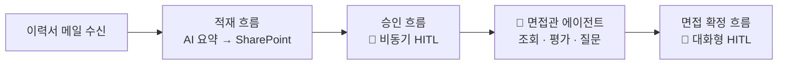

# 중급 — HR 채용 자동화 🤝

**"AI에게 일을 맡기되, 결정은 사람이 내립니다."**

이력서가 메일로 도착하는 순간부터 면접 확정까지, 사람과 AI가 역할을 나눠 갖는 HR 채용 자동화를 **직접 만들어 봅니다.** 보고, 따라 하고, 붙여넣으면 완성됩니다.

{: .note }
여기서부터는 **2일차(중급) 과정**입니다. 위쪽 [입문 Lab 1~6](https://jm-2ktech.github.io/cs_lab/docs/lab1.html)에서 배운 에이전트 생성·지식·지침·토픽·커넥터의 기초는 **다시 설명하지 않고 그대로 전제**합니다. 입문을 건너뛰고 여기부터 시작한다면 [중급 0. 시작하기 전에](./docs/before-you-start.html)를 반드시 먼저 읽으세요.

---

## 하루의 흐름

오전에는 **에이전트를 만들고 부려 봅니다.** 오후에는 그 에이전트가 다루던 데이터가 **어떻게 흘러 들어오는지**, 사람이 어디서 끊는지를 흐름으로 직접 짓습니다.

---

## 1부. 에이전트 — 만들고, 알려주고, 쓴다 🤖

오전입니다. 환경을 받고(Lab 1), 면접관 에이전트를 빚고(Lab 2), 그 에이전트를 부려 봅니다(Lab 3).

데이터는 이미 준비돼 있습니다. **"이미 있는 지원자 데이터를 에이전트로 다뤄 보는 것"** 이 1부의 목표입니다. 그 데이터가 어떻게 들어왔는지는 오후(2부)에서 직접 만듭니다.

| 랩 | 내용 | 시간 |
|---|---|---|
| [중급 Lab 1. 환경 초기화](./docs/lab1.html) | 솔루션에서 흐름을 내 것으로 복사해 리스트 세팅 | 10분 |
| [중급 Lab 2. 에이전트 구성](./docs/lab2.html) | 에이전트 생성 + 지식 4종 + 지침 | 10분 |
| [중급 Lab 3. 커넥터 구성](./docs/lab3.html) | 도구를 붙여 조회·평가·면접질문까지 | 30분 |

**1부 합계 50분.**

## 2부. 흐름 — 자동으로 흐르게, 사람이 끊는다 ⚙️

오후입니다. 오전에 다루던 그 데이터가 **어떻게 들어왔는지** 직접 만듭니다 — 이력서를 적재하고(Lab 4), 사람이 품질을 승인하고(Lab 5), 면접을 확정합니다(Lab 6~7).

오늘의 "흐름다운 빌드" 네 개가 모두 여기 모입니다. **"상태를 바꾸는 일은 흐름이 한다"** 는 것을, 만들면서 체득합니다.

| 랩 | 내용 | 시간 |
|---|---|---|
| [중급 Lab 4. 적재 흐름](./docs/lab4-alt.html) | 이력서 업로드 → AI 추출 → SharePoint | 40분 |
| [중급 Lab 5. 승인 흐름](./docs/lab5.html) | 비동기 HITL — 사람이 요약을 보증 | 40분 |
| [중급 Lab 6. AI 적합도 반영](./docs/lab6.html) | 두 겹 게이트로 안전한 갱신 | 30분 |
| [중급 Lab 7. 전형단계 변경](./docs/lab7.html) | 대화형 HITL — 토픽 + 확인 카드 | 50분 |

**2부 합계 2시간 40분.**

{: .important }
2부는 앞 랩의 결과물 위에 다음 랩이 쌓입니다. 각 랩 끝의 **완성 신호**가 보이지 않으면 다음으로 넘어가지 말고 알려 주세요.

## 부록

| 랩 | 내용 | 시간 |
|---|---|---|
| [중급 부록. 자가진단 에이전트](./docs/appendix-self-check.html) | 내 에이전트 점검하기 | 10분 |
| [중급 부록. 시연 — 외부 자료 뉴스레터](./docs/appendix-newsletter-demo.html) | 실습 아님 | 5분 |
| [중급 부록. 용어집](./docs/glossary.html) | 낯선 말이 나올 때 | — |

{: .note }
중급 용어집은 [입문 용어집](https://jm-2ktech.github.io/cs_lab/docs/glossary.html)과 **별개 페이지**입니다. 같은 용어라도 중급 쪽이 실무 맥락(SharePoint 컬럼·흐름 동작)까지 담고 있어 정의가 더 깁니다.

**실습 합계 3시간 40분** (Lab 1~7). 나머지 시간은 강의·시연·휴식입니다.

{: .note }
강의 도입부 **오리엔테이션 슬라이드**는 [여기서 내려받을 수 있습니다](assets/download/핸즈온%20인트로%20영상%20제거버전.pptx). [중급 0. 시작하기 전에](./docs/before-you-start.html)가 그 내용을 펼쳐 놓은 것입니다.

---

## 이 과정의 두 가지 질문

**1. 사람은 어디에 개입하는가 — HITL 두 패턴**
비동기(승인 흐름, Lab 5)와 대화형(면접 확정, Lab 7), 두 패턴을 모두 직접 만들어 적재적소를 익힙니다.

**2. 커넥터인가, 흐름인가 — 경계 판단**
조회·추론은 커넥터+지침으로 충분해지고, 흐름은 **상태를 바꾸는 트랜잭션**에 집중됩니다. Lab 3에서 "흐름 없이 어디까지"를 보고, Lab 6에서 "그래도 흐름이어야 하는 이유"를 직접 체험합니다.

{: .important }
입문 [Lab 6](https://jm-2ktech.github.io/cs_lab/docs/lab6.html) 스텝 8에서 목격한 것 — 지침에 확인 절차를 써뒀는데도 확인 없이 여러 건이 한 번에 바뀌던 장면 — 이 중급의 출발점입니다. **거기서 못 막았던 것을 여기서 흐름으로 강제합니다.**

> **핵심 가이드**
> 이 교육의 목표는 기능을 익히는 데서 끝나지 않습니다. 여러분이 자신의 업무를 보며 '여기에도 적용할 수 있겠다'는 생각을 스스로 떠올리고, 새로운 아이디어를 계속 만들어낼 수 있는 기반을 만드는 것입니다.

---

{: .note }
이 과정의 지원자 데이터(이름·이메일·이력서)는 모두 AI가 생성한 **가상 인물**의 데이터입니다. 실제 개인 정보를 시스템에 업로드하지 마세요.

[중급 시작하기 →](./docs/before-you-start.html){: .btn .btn-purple }

<!-- 저작 메모(2026-08-10 통합): 구 cs_lab_v2의 index.md + part1/index.md + part2/index.md
     세 파일을 이 한 장으로 합쳤다. nav는 평탄화(중급 > Lab 1~7)했지만 1부/2부 서사는
     본문 섹션으로 보존 — 그 구분은 고객사 차수의 오전/오후 편성에서 나온 것이라 nav 위계로
     둘 이유가 없다(제작자 결정 2026-08-10).
     2026-09-07: 고객사명·사이트 주소는 에듀랩(2ktech) 환경으로 치환해 공개했다.
     시나리오 자체(HR 채용, SharePoint 지원자 목록)는 그대로다 — 일반화는 별도 과제다. -->
